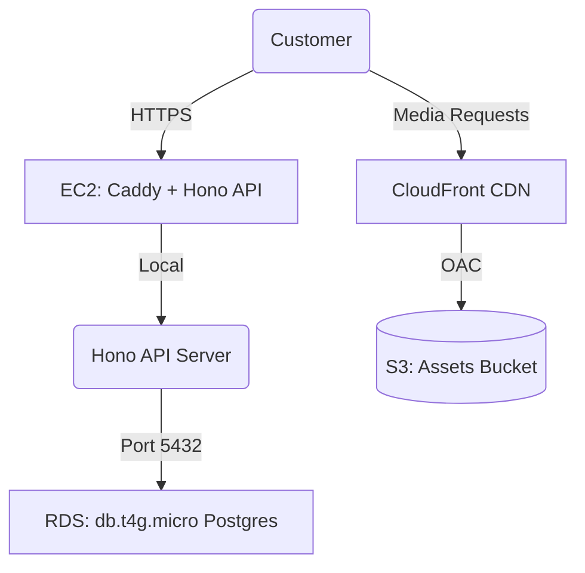
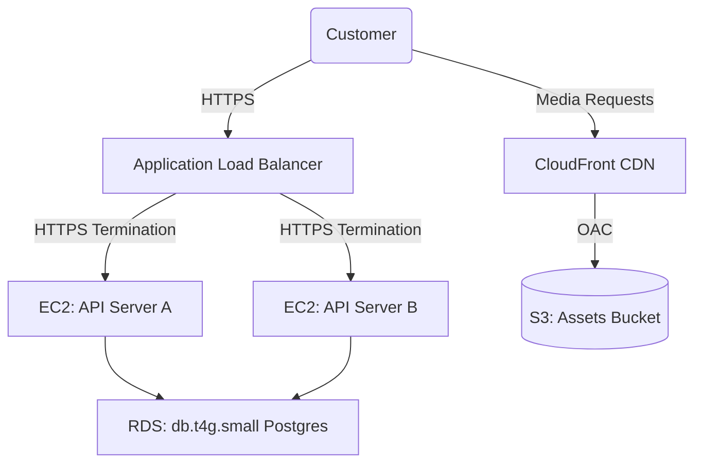

# Mumzo AWS Architecture & Costing Plan

This plan details the AWS resource configuration, domain mappings, service setup checklists, and tier-based scaling models (1k, 10k, and 100k Monthly Active Users) for the Mumzo storefront, API server, and admin portal.

---

## 1. Domain & Routing Architecture (`mumzo.in`)

To provide same-origin operations, clean caching, and isolation, the domain architecture is structured as follows:

| Domain | Target | Protocol / Service | Description |
|---|---|---|---|
| `mumzo.in` | Storefront Frontend | HTTPS (Vercel or CloudFront) | Main customer storefront (React PWA). |
| `www.mumzo.in` | Storefront Frontend | HTTPS Redirect to `mumzo.in` | Canonical redirect. |
| `admin.mumzo.in` | Admin Control Panel | HTTPS (Vercel or CloudFront) | SuperAdmin interface. |
| `api.mumzo.in` | Hono API Server | HTTPS (EC2 or ECS + ALB) | Backend Hono REST endpoints. |
| `cdn.mumzo.in` | Media CDN | HTTPS (CloudFront + S3) | Optimized delivery of product images, banners, and icons. |

---

## 2. AWS Services Checklist

Here is the exhaustive checklist of everything needed from AWS, organized by setup dependency:

### Phase 1: DNS & SSL (Pre-requisites)
- [ ] **Route 53 Hosted Zone**: Register or migrate `mumzo.in` domain. Set up records.
- [ ] **AWS Certificate Manager (ACM) Wildcard SSL**: Request a certificate for `*.mumzo.in` and `mumzo.in` in `us-east-1` (for CloudFront) and your primary region (e.g., `ap-south-1` for Mumbai).

### Phase 2: Assets CDN (`cdn.mumzo.in`)
- [ ] **S3 Bucket (`mumzo-assets`)**: Private bucket to store catalog images, customer uploads, and static assets.
- [ ] **CloudFront Distribution**: Mapped to `cdn.mumzo.in`.
- [ ] **Origin Access Control (OAC)**: Configured so the S3 bucket is only accessible through CloudFront (preventing direct S3 hotlinking and billing bypasses).

### Phase 3: Database & Backend Compute
- [ ] **VPC & Subnets**: Set up a custom VPC with 2 Public subnets and 2 Private subnets (for the database and internal services).
- [ ] **RDS PostgreSQL**: Provision Postgres instance in private subnets.
- [ ] **EC2 / ECS Security Groups**:
  - Database SG: Allows incoming port `5432` only from the API server's SG.
  - API Server SG: Allows incoming port `80`/`443` (HTTP/S) and SSH port `22` (restricted by IP).
- [ ] **EC2 Server Instance**: Provision ARM64 (Graviton) instances (e.g. `t4g.*`) running Ubuntu to host the Hono Bun app.

### Phase 4: Communications & Email
- [ ] **Amazon SES (Simple Email Service)**:
  - Verify `mumzo.in` domain.
  - Configure DKIM, SPF, and DMARC DNS records in Route 53 to ensure high deliverability of OTPs and transactional notifications.
  - Move the account from the SES sandbox to production mode.

---

## 3. Scale Tiers & Cost Projections

These projections assume **ap-south-1 (Mumbai)** region hosting for lowest latency to Indian customers.

### Tier 1: MVP Starter (1k MAU)
Designed for minimal cost while maintaining same-origin features. To save costs, we omit the Application Load Balancer ($22/mo) and run SSL termination directly on the EC2 server using a lightweight reverse proxy like Caddy.

* **Backend Server**: 1x `t4g.small` EC2 instance ($12/mo) running Caddy (handles SSL & reverse proxy) and PM2/Bun (Hono).
* **Database**: 1x `db.t4g.micro` RDS PostgreSQL Single-AZ ($15/mo).
* **Media Assets**: S3 Storage + CloudFront (within AWS Free Tier limits for 1k MAU) ($1/mo).
* **Emails/OTPs**: SES (~10,000 emails/mo) ($1/mo).
* **Total Estimated Cost**: **~$29 / month**

---

### Tier 2: Production Growth (10k MAU)
Introduces high availability, proper SSL termination via ALB, and automatic database backups.

* **Load Balancer**: 1x Application Load Balancer ($22/mo) doing SSL termination with ACM.
* **Backend Server**: 2x `t4g.small` EC2 instances ($24/mo) distributed in separate Availability Zones for redundancy.
* **Database**: 1x `db.t4g.small` RDS PostgreSQL Single-AZ (with automated daily snapshots) ($30/mo).
* **Media Assets**: S3 Storage + CloudFront CDN (serving ~200GB transfer/mo) ($15/mo).
* **Emails/OTPs**: SES (~100,000 emails/mo) ($10/mo).
* **Total Estimated Cost**: **~$101 / month**

---

### Tier 3: Scale (100k MAU)
High-performance, auto-scaled containerized backend and Multi-AZ database setup.

* **Load Balancer**: 1x Application Load Balancer ($25/mo).
* **Backend Server**: ECS Fargate container instances (auto-scaled between 2 to 6 tasks based on CPU usage) (~$75/mo).
* **Database**: `db.r6g.large` (Memory Optimized Graviton) RDS PostgreSQL in Multi-AZ configuration (high availability with automatic failover) (~$350/mo).
* **Cache**: `cache.t4g.medium` Amazon ElastiCache (Redis) for session management, OTP rate-limiting, and catalog cache (~$30/mo).
* **Media Assets**: S3 Storage + CloudFront CDN (serving ~2TB transfer/mo) (~$100/mo).
* **Emails/OTPs**: SES (~1,000,000 emails/mo) (~$100/mo).
* **Total Estimated Cost**: **~$680 / month**

---

## 4. Key Deployment Recommendations

1. **Vercel vs AWS for Frontend**:
   * Keep storefront (`mumzo.in`) and admin (`admin.mumzo.in`) on **Vercel** (Pro plan: $20/mo). Vercel offers global edge CDNs, automated build previews, and instant rollback.
   * Run only the API (`api.mumzo.in`) and Database/Assets on **AWS**. This keeps AWS costs low and devops overhead minimal.
2. **Graviton (ARM64) Instances**:
   * Always choose Graviton instances (`t4g`, `r6g`, etc.) for both EC2 and RDS. They are **20% cheaper** and offer **up to 40% better performance** than x86 equivalents.
3. **Database Backups**:
   * Ensure 7-day retention for automated RDS backups. Enable Storage Auto-scaling to prevent database lockups when space runs out.
