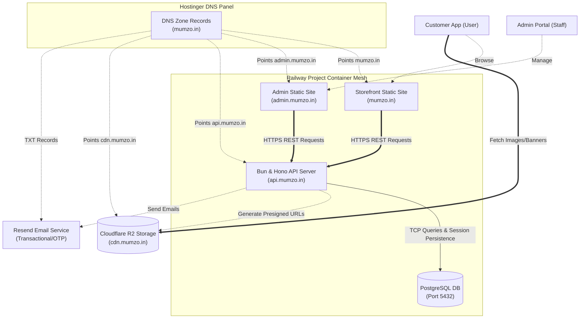

# Mumzo System Architecture (Draw.io / Mermaid Import)

This document contains the **Mermaid.js** diagram code representing the Mumzo system architecture.

Draw.io (diagrams.net) supports importing Mermaid code natively.

---

## 1. Mermaid Code

Copy the block below:

---

## 2. How to import this into Draw.io (diagrams.net)

1. Open a blank canvas on [Draw.io](https://app.diagrams.net/).
2. On the top menu toolbar, click **+ (Insert)** or select **Arrange** -> **Insert**.
3. Hover over **Advanced** and click **Mermaid**.
4. Paste the Mermaid code block from above into the text box.
5. Click **Insert**. Draw.io will automatically parse the code and render it as editable visual shapes on your canvas!
