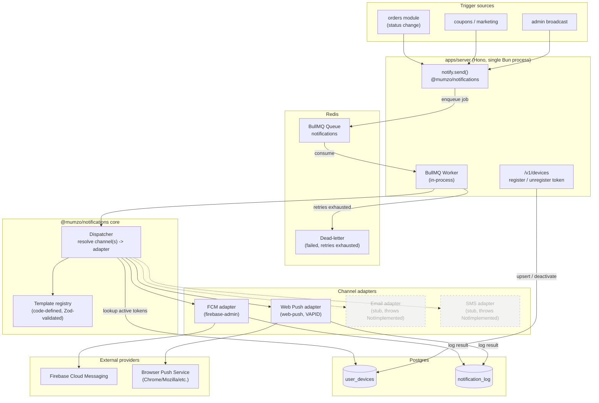
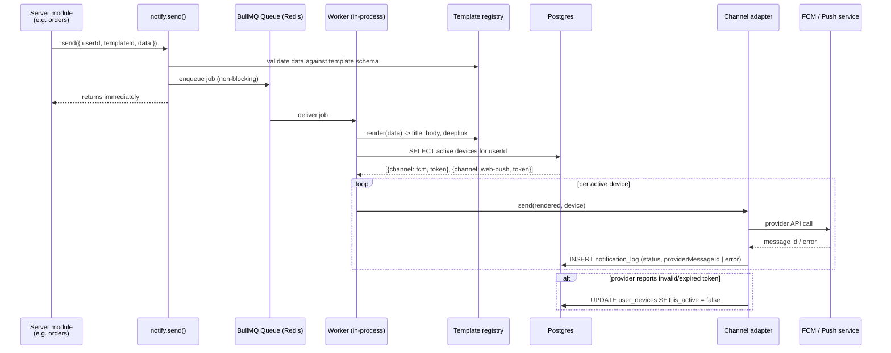
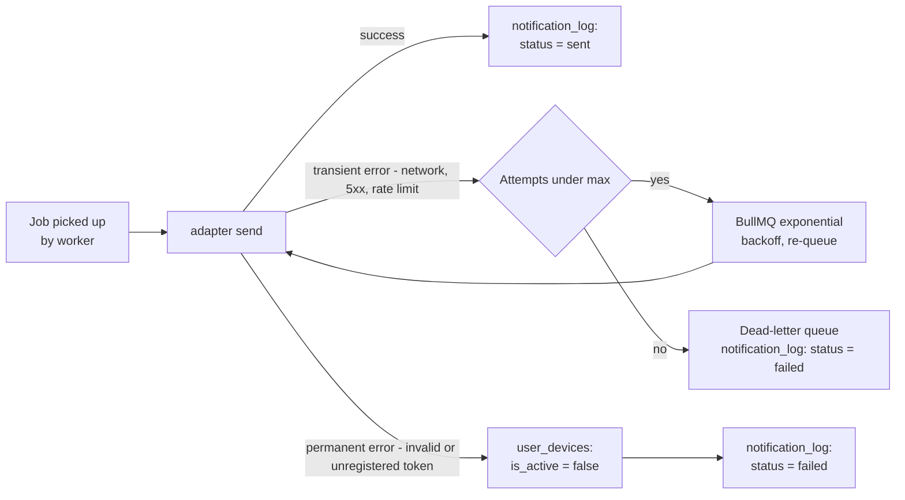
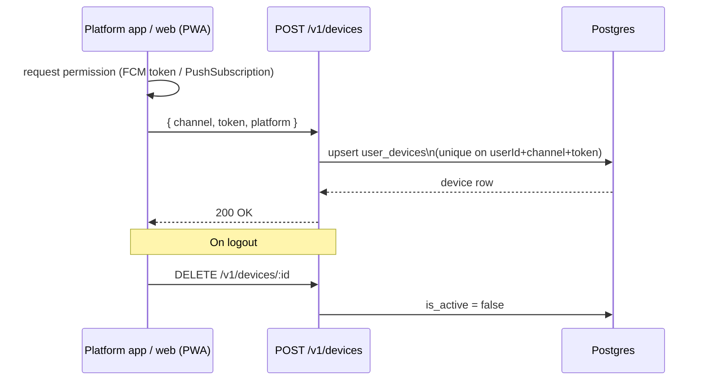
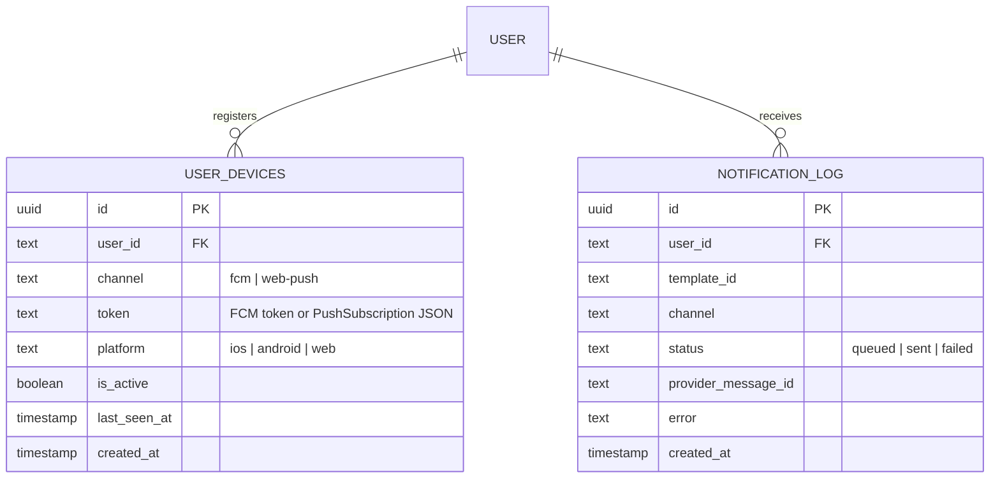
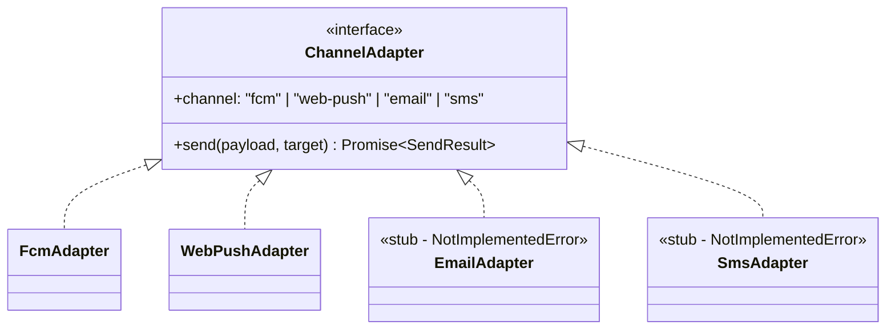

# Mumzo — Notification System Architecture

Production notification pipeline: Redis-backed queue, adapter-based channel
delivery (FCM + Web Push in v1, email/SMS scaffolded), code-defined templates.
This is a **design doc** — nothing here is implemented yet.

- **Queue** → BullMQ (Redis)
- **Package** → `packages/notifications` (`@mumzo/notifications`)
- **Worker** → in-process with `apps/server`, same Bun process as the API
- **Channels v1** → `fcm`, `web-push` (real adapters) · `email`, `sms` (interface stub only)
- **Audiences** → `customer` (`user_device`) and `staff` (`staff_device`) — see [realtime-architecture.md](./realtime-architecture.md) for how staff push relates to the WebSocket live feed

---

## 1. System architecture

---

## 2. Send flow (happy path)

---

## 3. Failure & retry flow

---

## 4. Device registration flow

---

## 5. ER diagram

`notification_templates` is **not** a table in v1 — templates are code-defined
in `packages/notifications/src/templates/*.ts` (type-safe, Zod-validated,
deployed with the app). Revisit as a DB table only if marketing needs
self-serve editing without a deploy.

---

## 6. Adapter interface

Every channel implements the same contract — adding a channel later means a
new folder under `channels/` plus a registration line, nothing else changes.

---

## 7. Infra additions

| Component | Change |
|---|---|
| `infra/docker-compose.yml` | new `redis` service (redis:7-alpine), same healthcheck pattern as `postgres` |
| `packages/env` | `REDIS_URL`, FCM service-account creds, `VAPID_PUBLIC_KEY` / `VAPID_PRIVATE_KEY` / `VAPID_SUBJECT` |
| `apps/server` deps | `bullmq`, `ioredis`, `firebase-admin`, `web-push` |
| `apps/server/src/index.ts` | starts BullMQ `Worker` alongside Hono on boot; graceful shutdown on SIGTERM alongside the DB pool |
| `packages/db/src/schema/notifications.ts` | `user_devices`, `notification_log` |
| `apps/server/src/modules/platform/v1/devices` | new module: register/unregister device tokens |

---

## 8. Open items for a later revision

- Web Push VAPID key generation + service worker wiring on `apps/platform`.
- Per-user notification preferences (opt-in/out per category) — not in v1.
- Bull Board (or similar) for queue observability.
- Broadcast/segment recipient resolver for admin marketing sends.
