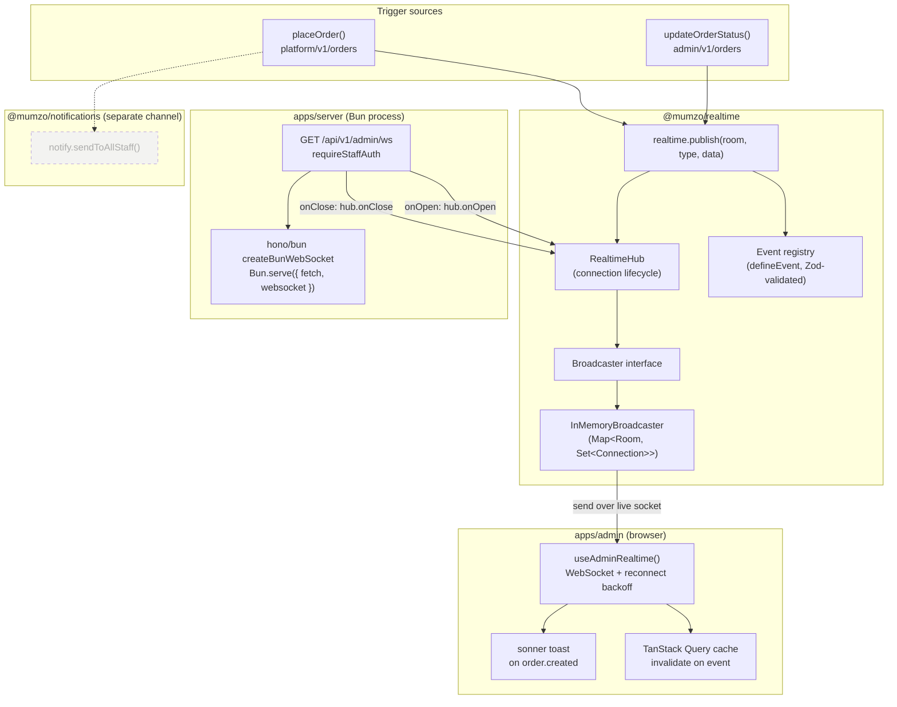
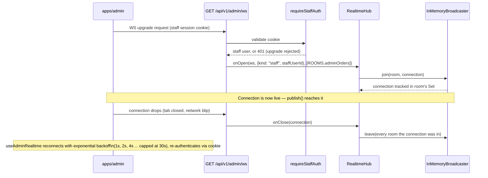
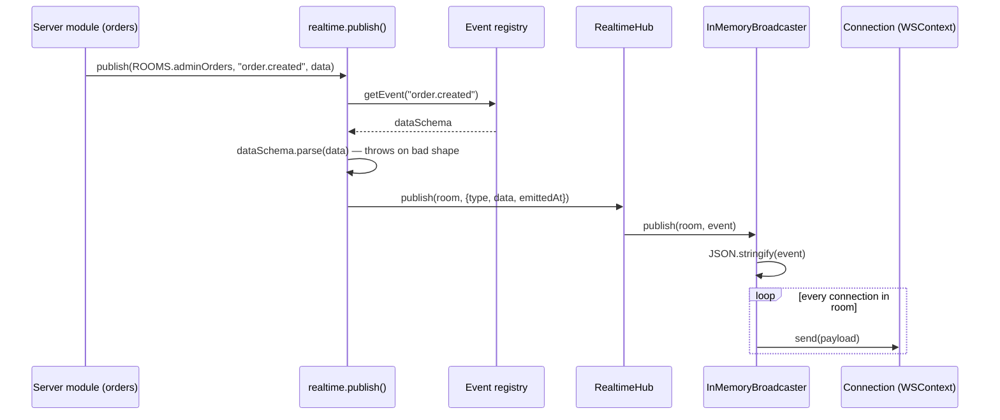
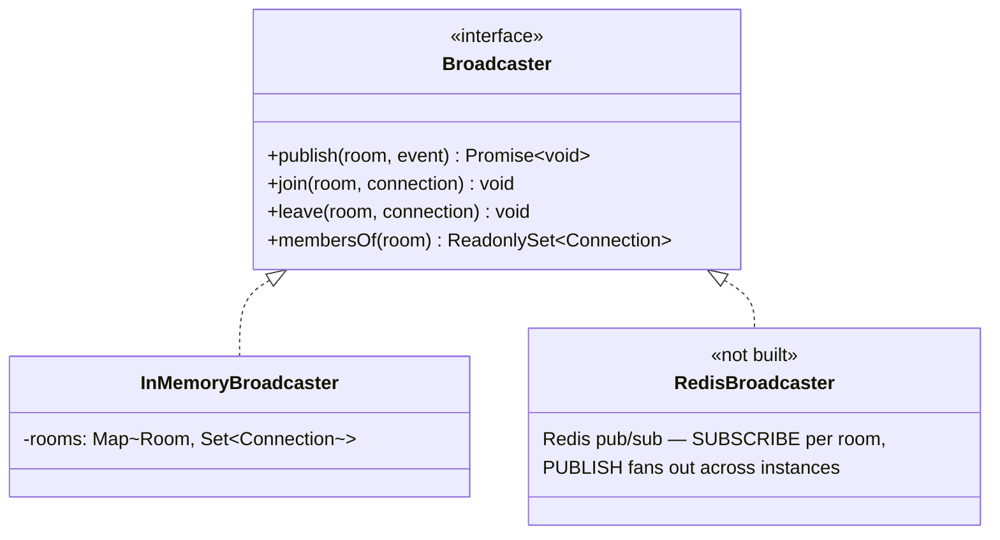

# Mumzo — Realtime (WebSocket) Architecture

Live admin feed for order events, built as an extensible pub/sub layer —
not a one-off "broadcast new orders" handler. Any future feature (chat,
live delivery tracking, inventory alerts) plugs into the same connection
registry, room model, and event registry.

- **Package** → `packages/realtime` (`@mumzo/realtime`)
- **Transport** → Bun-native WebSocket via `hono/bun`'s `createBunWebSocket`
- **Scope today** → admin/staff dashboard only (`admin:orders` room);
  customer-facing rooms (e.g. live delivery tracking) are a future room,
  not a redesign
- **Complements** → `@mumzo/notifications` (FCM/web-push) — WS is the
  live in-app channel, push is the "alert when the tab isn't focused"
  channel. Both fire from the same trigger point.

---

## 1. Why two channels, not one

| | WebSocket | FCM / Web Push |
|---|---|---|
| Latency | Instant, in-process | Seconds, through Google's infra |
| Requires | Dashboard tab open | Nothing — OS-level notification |
| Payload | Rich, structured (full event data) | Title/body + small data payload |
| Durability | None — dead the moment the tab closes | Delivered even if the app wasn't running |
| Best for | Live-updating the order queue table | Waking someone up who's stepped away |

Both are triggered from the same place (`placeOrder`, `updateOrderStatus`)
so they never drift out of sync — see §5.

---

## 2. System architecture



---

## 3. Connection lifecycle



---

## 4. Publish flow



`publish()` is called fire-and-forget from the order service — a broadcast
failure must never fail an order that already committed to the database.

---

## 5. Room model

A room is just a string channel — connections join one or more, `publish`
fans out to everyone in it.

| Room | Who joins | Used for |
|---|---|---|
| `admin:orders` | Every connected staff member, on upgrade | `order.created`, `order.status_updated` |

Adding a room later (e.g. per-hub scoping, or a customer-facing
`customer:order:<id>` room for live delivery tracking) means:
1. Add the constant to `ROOMS` in `packages/realtime/src/core/rooms.ts`.
2. Decide which rooms a connection joins at upgrade time (or extend the
   upgrade handler to accept a `{ type: "subscribe", room }` client message
   for dynamic subscription — the `Connection.rooms` set and
   `Broadcaster.join`/`leave` already support joining after connect).

Nothing in `publish()` or the broadcaster changes.

---

## 6. Event registry

Mirrors `@mumzo/notifications`' template registry — same reasoning: a
`publish()` call with a malformed payload should fail loudly at the call
site, not ship a broken payload to every connected client.

```ts
export const orderCreatedEvent = defineEvent({
  type: "order.created",
  dataSchema: z.object({
    orderId: z.string(),
    hubId: z.string(),
    total: z.number(),
    addressName: z.string(),
  }),
});
```

| Event | Data | Fired from |
|---|---|---|
| `order.created` | `{ orderId, hubId, total, addressName }` | `platform/v1/orders` `placeOrder()` |
| `order.status_updated` | `{ orderId, fromStatus, toStatus }` | `admin/v1/orders` `updateOrderStatus()` |

Adding an event: new file under `packages/realtime/src/events/`,
`defineEvent(...)`, import it as a side effect in `events/index.ts` (same
side-effect-registration pattern as notification templates — the import
guarantees registration before `publish`/`getEvent` are called, regardless
of what a caller imports directly).

---

## 7. Scaling seam — the `Broadcaster` interface



`InMemoryBroadcaster` (a `Map<Room, Set<Connection>>`) is correct as long
as the API runs as **one process** — true today, same assumption the
notification worker already makes (in-process BullMQ worker).

**The limitation**: the moment the server scales to 2+ replicas, a
`publish()` on instance A never reaches a client connected to instance B.
That's the point at which `RedisBroadcaster` gets built against the same
`Broadcaster` interface — nothing in `events/*`, the order services, or the
admin client needs to change. Not built now because it's not needed now;
the seam exists so it's additive later.

---

## 8. Client (`apps/admin`)

- `core/realtime/use-admin-realtime.ts` — opens `wss://<server>/api/v1/admin/ws`
  (same host resolution as the REST client, cookie auth rides along
  automatically on the upgrade request). Exponential backoff on
  disconnect (1s → 30s cap), no manual retry limit — a staff member's
  shift can be long-running.
- Mounted once in `pages/(admin)/_layout.tsx`'s `AdminGroupLayout` — after
  the auth gate passes, wraps every admin route, so the connection
  survives client-side navigation instead of reconnecting per page.
- On any order event: invalidates `queryKeys.orders.all` (TanStack Query
  refetches the order list/detail that's currently mounted).
- On `order.created` specifically: `sonner` toast.
- Event types in `core/realtime/events.ts` are hand-mirrored from
  `packages/realtime/src/events/orders.ts`, not imported — `@mumzo/realtime`
  pulls in `hono/bun` (Bun/Node WS glue) that has no place in a Vite
  browser bundle. A drift between the two just fails type-narrowing on the
  client, the same failure mode as any other hand-maintained API contract.

---

## 9. Infra / additions

| Component | Change |
|---|---|
| `apps/server/src/index.ts` | Default export changed from a bare Hono app to `{ fetch: app.fetch, websocket }` — Bun's implicit-serve form only starts a WS-capable server when `websocket` is present alongside `fetch`. |
| `apps/server/src/modules/admin/v1/ws` | New module — `GET /api/v1/admin/ws`, `requireStaffAuth`, joins `ROOMS.adminOrders`. |
| `apps/server/src/modules/admin/v1/devices` | New module — staff push-token registration (`POST`/`DELETE /api/v1/admin/devices`), backs the FCM side of §1. |
| `packages/db/src/schema/notifications.ts` | `staff_device` table (staff equivalent of `user_device`); `notification_log` gained a nullable `staff_user_id` alongside the existing nullable-after-this-migration `user_id`. |
| `packages/notifications` | `Audience` (`"customer" \| "staff"`) added to `NotificationJobInput`; dispatcher branches on it to query `user_device` vs `staff_device`. New `notify.sendToAllStaff(templateId, data)` — fans out one job per staff member with an active device (no hub/team assignment on staff yet, so "all staff" is the only audience). |

---

## 10. Open items for a later revision

- Per-hub rooms (`admin:orders:<hubId>`) once hub-scoped dashboards exist.
- Client-driven dynamic room subscription (`{ type: "subscribe", room }`
  message) — the server-side plumbing (`Connection.rooms`,
  `Broadcaster.join`/`leave`) already supports it; only the upgrade
  handler's `onMessage` needs to use it.
- `RedisBroadcaster` — only once the server runs multiple instances.
- Customer-facing rooms (live delivery tracking, order chat).
