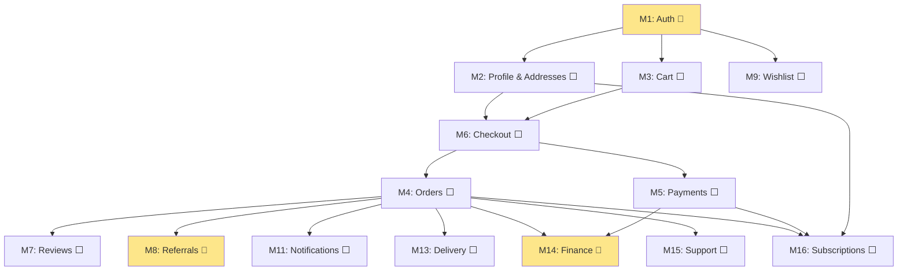

# Mumzo — Project Plan (Jira-Ready)

> **Quick-commerce for moms & babies** · 10-min delivery · Hyderabad launch
>
> **Legend:** ✅ Done · 🔶 Partial · ⬜ Not started
> **Layers:** `PF` = Platform (customer app) · `AD` = Admin panel · `BE` = Backend/DB

---

## Current State Summary

| Area | Done | Partial | Not Started |
|------|------|---------|-------------|
| **Catalog** (Products, Categories, Brands, Vendors, Bundles, Inventory) | ✅ Full CRUD — BE + Admin + Platform | — | — |
| **Auth** | 🔶 Backend works, UI forms not wired | — | OTP, Google OAuth |
| **Home & Discovery** | ✅ Full page — categories, deals, bestsellers, brands, collections | — | Personalization |
| **Search & Filters** | ✅ Full filter panel, sort, URL-driven state | — | Full-text/Typesense |
| **Product Detail** | ✅ Full page — gallery, sizes, price, highlights, related | — | Reviews section |
| **Coupons** | ✅ Admin CRUD + validate API | — | Customer coupon listing |
| **Cart → Checkout → Orders → Payments** | ⬜ Routes exist, no functionality | — | Everything |
| **Reviews, Wishlist, Referrals** | 🔶 Route/placeholder pages exist | — | All backend + real UI |
| **Delivery & Dispatch** | ⬜ | — | Everything |
| **Notifications, Subscriptions, Support** | ⬜ Route placeholders only | — | Everything |

---

## Phase 1 — Foundation

---

### MODULE 1: Auth & Onboarding

> **Priority:** P0 · **Blocks:** Everything

#### 1.1 Email/Password Auth
| Sub-feature | Status | Notes |
|-------------|--------|-------|
| Sign-in form (email + password) | 🔶 | BE works (Better Auth), PF form not built |
| Sign-up form (name, email, password) | 🔶 | BE works, PF form not built |
| Forgot password page | 🔶 | BE works, PF page route exists, form not wired |
| Reset password page | 🔶 | BE works, PF page route exists, form not wired |
| Email verification page | 🔶 | BE works, PF page route exists, not wired |
| Post-login redirect (return to cart/previous page) | ⬜ | |
| Session persistence + auto-refresh | ✅ | Better Auth handles this |
| Protected route guard | ✅ | `(protected)/_layout.tsx` with `beforeLoad` |

#### 1.2 Phone OTP Login
| Sub-feature | Status | Notes |
|-------------|--------|-------|
| OTP send + verify (MSG91 integration) | ⬜ | Better Auth plugin not added |
| OTP input page (`/auth/otp`) | ⬜ | |
| DLT registration (India regulatory) | ⬜ | Takes 3–7 days |

#### 1.3 Google OAuth
| Sub-feature | Status | Notes |
|-------------|--------|-------|
| Google Cloud credentials setup | ⬜ | |
| Google sign-in button on login page | ⬜ | |
| Better Auth social plugin | ⬜ | |

#### 1.4 Guest Browsing & Serviceability
| Sub-feature | Status | Notes |
|-------------|--------|-------|
| Guest browse (no auth needed for catalog) | ✅ | Public routes work |
| Location/pincode picker component | 🔶 | Module exists, UI not wired |
| Serviceability check API | ⬜ | |
| Gate checkout if unserviceable | ⬜ | |

---

### MODULE 2: User Profile & Addresses

> **Priority:** P0 · **Depends on:** M1 Auth

#### 2.1 Addresses
| Sub-feature | Status | Notes |
|-------------|--------|-------|
| Address DB schema | ⬜ | |
| Address CRUD (create, edit, delete, set default) | ⬜ | |
| Address list page (`/addresses`) | 🔶 | Route exists, no content |
| Add/edit address form (with pincode validation) | ⬜ | |
| Map autocomplete (Google Places) | ⬜ | |

#### 2.2 Profile
| Sub-feature | Status | Notes |
|-------------|--------|-------|
| Profile view/edit page (`/profile`) | 🔶 | Route exists, form not wired |
| Profile API (get + update) | 🔶 | BE endpoint exists |
| Avatar upload (R2) | ⬜ | |
| Baby profile (name, DOB → age-based recs) | ⬜ | |
| Account deletion (GDPR) | ⬜ | |

---

### MODULE 3: Cart

> **Priority:** P0 · **Depends on:** M1 Auth (for merge), Catalog ✅

#### 3.1 Cart Backend
| Sub-feature | Status | Notes |
|-------------|--------|-------|
| Cart + cart item DB schema | ⬜ | |
| Add to cart (with stock validation) | ⬜ | |
| Update quantity / remove item | ⬜ | |
| Apply / remove coupon | ⬜ | Coupon validate API exists ✅ |
| Calculate totals (subtotal, GST 5%, delivery fee, discount) | ⬜ | |
| Guest cart + merge on login | ⬜ | |
| Clear cart | ⬜ | |

#### 3.2 Cart UI (Platform)
| Sub-feature | Status | Notes |
|-------------|--------|-------|
| Cart page layout (items + summary sidebar) | ⬜ | Route exists |
| Cart item card (image, name, size, qty, remove) | ⬜ | |
| Price summary (subtotal, GST, delivery, discount, total) | ⬜ | |
| Coupon input + apply/remove | ⬜ | |
| Empty cart state | ⬜ | |
| "Proceed to checkout" CTA (min-order validation) | ⬜ | |
| Cart badge/count in header | ⬜ | |
| Wire PDP "Add to cart" to real API | ⬜ | Currently toast-only |
| Out-of-stock handling (flag + alternatives) | ⬜ | |
| Free-delivery progress nudge | ⬜ | |
| Cross-sell "Frequently added" section | ⬜ | |

---

## Phase 2 — Core Commerce (The Money Path)

---

### MODULE 4: Orders

> **Priority:** P0 · **Depends on:** M3 Cart, M2 Addresses

#### 4.1 Orders Backend
| Sub-feature | Status | Notes |
|-------------|--------|-------|
| Order + order item DB schema | ⬜ | |
| Order status lifecycle (`pending_payment → confirmed → packed → shipped → out_for_delivery → delivered → cancelled → return_requested → returned`) | ⬜ | |
| Order status log (transitions with timestamps) | ⬜ | |
| Place order (validate cart, snapshot items, create order, clear cart) | ⬜ | |
| List user's orders (paginated, filterable) | ⬜ | |
| Order detail (items, status, timeline, address) | ⬜ | |
| Cancel order (within cancellation window) | ⬜ | |
| Return/refund request | ⬜ | |
| Reorder (re-add items to cart) | ⬜ | |
| Invoice PDF (GST) | ⬜ | |

#### 4.2 Orders UI (Platform)
| Sub-feature | Status | Notes |
|-------------|--------|-------|
| Order history page (`/orders`) | 🔶 | Route exists, mock data |
| Order detail page (`/orders/$orderId`) | 🔶 | Route exists, mock data |
| Order confirmation / success page | ⬜ | |
| Cancel order flow (reason + confirmation) | 🔶 | Route exists |
| Order tracking page | 🔶 | Route exists |
| Return/refund request page | 🔶 | Route exists |
| Reorder button | ⬜ | |
| Invoice download | ⬜ | |

#### 4.3 Orders Admin
| Sub-feature | Status | Notes |
|-------------|--------|-------|
| All orders list (filters, status, date, user) | 🔶 | Page + table component exist, not wired to real API |
| Order detail (items, customer, payment, timeline) | 🔶 | Page exists |
| Status transition controls (advance order lifecycle) | ⬜ | |
| Admin cancel with reason | ⬜ | |
| Assign delivery partner / rider | ⬜ | |
| Return/refund processing | ⬜ | |
| Orders CSV export | ⬜ | |
| SLA-breach monitoring | ⬜ | |

---

### MODULE 5: Payments

> **Priority:** P0 · **Depends on:** M4 Orders

#### 5.1 Payments Backend
| Sub-feature | Status | Notes |
|-------------|--------|-------|
| Payment + refund DB schema | ⬜ | |
| Razorpay integration (create order, verify signature, capture) | ⬜ | |
| Razorpay webhook handler (async status updates) | ⬜ | |
| COD handling (no gateway, manual flow) | ⬜ | |
| Refund initiation (via Razorpay) | ⬜ | |
| Payment retry on failure | ⬜ | |

#### 5.2 Payments UI (Platform)
| Sub-feature | Status | Notes |
|-------------|--------|-------|
| Payment method selector (UPI, Card, Netbanking, Wallet, COD) | ⬜ | |
| Razorpay checkout.js integration (popup flow) | ⬜ | |
| Payment status page (`/payment/status`) — success / failure / processing | 🔶 | Route exists |
| Payment retry on failure | ⬜ | |

#### 5.3 Payments Admin
| Sub-feature | Status | Notes |
|-------------|--------|-------|
| Payments list page | 🔶 | Page + table component exist |
| Payment detail page | 🔶 | Page exists |
| Failed/pending payments view | 🔶 | Page exists |
| Manual refund processing | ⬜ | |
| Reconciliation (gateway vs internal) | 🔶 | Page exists |

---

### MODULE 6: Checkout Flow

> **Priority:** P0 · **Depends on:** M2 Addresses, M3 Cart, M4 Orders, M5 Payments
> *This is the glue module — assembles all the above into one flow*

| Sub-feature | Status | Notes |
|-------------|--------|-------|
| Checkout step indicator (Address → Payment → Review) | ⬜ | |
| Address selection step (`/checkout/address`) | 🔶 | Route + layout exist |
| Add new address inline during checkout | ⬜ | |
| Payment method step (`/checkout/payment`) | 🔶 | Route exists |
| Order review step (`/checkout/review`) | 🔶 | Route exists |
| Order summary sidebar (persistent across steps) | ⬜ | |
| Place order → payment → confirmation flow | ⬜ | |
| Delivery slot selector (express 10-min + scheduled) | ⬜ | |
| Delivery instructions | ⬜ | |

---

## Phase 3 — Growth

---

### MODULE 7: Reviews & Ratings

> **Priority:** P1 · **Depends on:** M4 Orders (verified purchase)

#### 7.1 Reviews Backend
| Sub-feature | Status | Notes |
|-------------|--------|-------|
| Review DB schema (rating, title, body, images, verified badge) | ⬜ | |
| Submit review (verified purchase check) | ⬜ | |
| List reviews (paginated, sortable by newest/helpful/rating) | ⬜ | |
| Edit / delete own review | ⬜ | |
| Helpful vote | ⬜ | |
| Auto-update product rating aggregate | ⬜ | Product `rating` column exists ✅ |

#### 7.2 Reviews UI (Platform)
| Sub-feature | Status | Notes |
|-------------|--------|-------|
| Reviews page (`/product/$productId/reviews`) | 🔶 | Route exists |
| Rating breakdown histogram | ⬜ | |
| "Write a review" form (stars + text + photo upload) | ⬜ | |
| Review summary on PDP (avg + count + top 3) | 🔶 | Stars shown, count hardcoded |
| Helpful vote button | ⬜ | |
| Verified-purchase badge | ⬜ | |
| Post-order "Write review" page | 🔶 | Route exists at `/orders/$orderId/review` |

#### 7.3 Reviews Admin (Moderation)
| Sub-feature | Status | Notes |
|-------------|--------|-------|
| Review moderation queue (approve/reject/flag) | 🔶 | Admin page exists, no API |
| Spam/profanity auto-filter | ⬜ | |
| Image moderation | ⬜ | |

---

### MODULE 8: Referral System

> **Priority:** P1 · **Depends on:** M4 Orders (settlement engine)
> **Spec:** [referral_system_architecture.md](file:///home/bikram/Desktop/Work/mumzo/mumzo_app/docs/platform/referral_system_architecture.md)

#### 8.1 Referral Backend
| Sub-feature | Status | Notes |
|-------------|--------|-------|
| Referral DB schema (tiers, codes, referrals, coupons) | ⬜ | Spec finalized |
| Tier config (1/3/5/10 → ₹150/400/600/2000) | ⬜ | |
| Referral code generation + validation | ⬜ | |
| 3-stage invite tracking (link_shared → signed_up → order_placed → completed) | ⬜ | |
| Settlement engine (cron: return-window expiry → issue coupon) | ⬜ | |
| Return-window revocation | ⬜ | |
| Hook into signup flow (auto-apply referral code) | ⬜ | |
| Hook into order placement (mark referee's first order) | ⬜ | |

#### 8.2 Referral UI (Platform)
| Sub-feature | Status | Notes |
|-------------|--------|-------|
| Referral page (`/referrals`) | 🔶 | Page exists with mock data, not wired |
| Referral code display + share (WhatsApp, copy link) | 🔶 | Mock code shown |
| Tier ladder (milestone progress rungs) | 🔶 | Component exists with mock |
| Earned coupons list (with status badges) | ⬜ | |
| Invite tracker (3-stage per-friend progress) | ⬜ | |
| FAQ accordion | ⬜ | |
| Referral link landing page (`/r/$code`) | ⬜ | |

#### 8.3 Referral Admin
| Sub-feature | Status | Notes |
|-------------|--------|-------|
| Referral manager page | 🔶 | Page + component exist, no real API |
| Tier config CRUD | ⬜ | |
| Referral stats dashboard | ⬜ | |
| Referral list (all referrals, status filters) | ⬜ | |

---

### MODULE 9: Wishlist

> **Priority:** P1 · **Depends on:** M1 Auth

| Sub-feature | Status | Notes |
|-------------|--------|-------|
| Wishlist DB schema | ⬜ | |
| Add/remove from wishlist | ⬜ | |
| Wishlist page (`/wishlist`) | 🔶 | Route exists |
| Move to cart | ⬜ | |
| PDP wishlist toggle (wire to real API) | 🔶 | Local state only currently |
| Price-drop / back-in-stock alerts | ⬜ | |

---

### MODULE 10: Search

> **Priority:** P1 · **Depends on:** Catalog ✅

| Sub-feature | Status | Notes |
|-------------|--------|-------|
| Search page (`/search`) with results grid | ✅ | Full filter panel, sort, URL-driven |
| Category browse with filters | ✅ | Brand, size, price, age, type filters |
| Sort (relevance, price, discount, rating) | ✅ | |
| Text search (`?q=` param) | ✅ | Basic query matching works |
| Search bar in header → `/search?q=` | ✅ | |
| Loading skeleton + empty state | ✅ | |
| Full-text search engine (Postgres tsvector or Typesense) | ⬜ | Currently basic `ILIKE` |
| Autocomplete suggestions (as-you-type) | ⬜ | |
| Trending searches | ⬜ | |
| Recent searches (per-user) | ⬜ | |
| Typo tolerance / fuzzy matching | ⬜ | |
| No-results state with suggestions | ✅ | Clear filters shown |

---

### MODULE 11: Notifications

> **Priority:** P1 · **Depends on:** M4 Orders (order status updates)

#### 11.1 Notifications Backend
| Sub-feature | Status | Notes |
|-------------|--------|-------|
| Notification DB schema | ⬜ | |
| Push token registration (FCM) | ⬜ | |
| Firebase Cloud Messaging integration | ⬜ | |
| Internal notification service (trigger on order events) | ⬜ | |
| Notification preferences (channel + category opt-in) | ⬜ | |

#### 11.2 Notifications UI (Platform)
| Sub-feature | Status | Notes |
|-------------|--------|-------|
| Notification center page (`/notifications`) | 🔶 | Route exists |
| Notification bell icon with unread badge | ⬜ | |
| Push permission prompt (contextual) | ⬜ | |
| Notification preferences page | 🔶 | Route exists at `/profile/notifications` |

#### 11.3 Notifications Admin (Broadcasts)
| Sub-feature | Status | Notes |
|-------------|--------|-------|
| Broadcast compose + send | 🔶 | Pages exist (`broadcasts/new`, `broadcasts/index`) |
| Past broadcasts list | 🔶 | Page exists |
| Segment targeting | 🔶 | Page exists at `customers/segments` |

---

## Phase 4 — Operations

---

### MODULE 12: Vendors & Supply Chain

> **Priority:** P1 · **Depends on:** Catalog ✅

| Sub-feature | Status | Notes |
|-------------|--------|-------|
| Vendor DB schema | ✅ | `vendor` table in catalog.ts |
| Vendor CRUD API | ✅ | Admin endpoints built |
| Vendor admin pages (list, detail, edit, create) | ✅ | Pages + components exist |
| Product ↔ vendor assignment (`product_vendor` table) | ✅ | Schema + API done |
| Vendor CSV import | ⬜ | |
| Purchase orders (PO) schema | ⬜ | |
| PO creation flow (vendor → products → quantities) | ⬜ | |
| GRN (Goods Received Note — confirm received, auto-update inventory) | ⬜ | |

---

### MODULE 13: Delivery & Dispatch

> **Priority:** P0 (need for live orders) · **Depends on:** M4 Orders

#### 13.1 Delivery Assignment
| Sub-feature | Status | Notes |
|-------------|--------|-------|
| Rider DB schema (name, phone, vehicle, hub, status) | ⬜ | |
| Delivery assignment DB schema (order → rider mapping) | ⬜ | |
| Assign rider to order | ⬜ | |
| Dispatch board (unassigned orders → assign riders) | 🔶 | Admin page exists at `operations/dispatch` |
| Rider CRUD (add, edit, deactivate) | 🔶 | Admin pages exist at `operations/riders` |

#### 13.2 Hub Management
| Sub-feature | Status | Notes |
|-------------|--------|-------|
| Hub DB schema | ✅ | `hub` table in catalog.ts |
| Hub CRUD API | ✅ | Admin endpoints built |
| Hub admin page (list, create, edit) | ✅ | Page + dialog exist |
| Pincode → hub mapping (which hub serves which zones) | ⬜ | |
| Stock grid per hub | ✅ | Inventory table + adjust dialog |

#### 13.3 3PL Integration (Fallback)
| Sub-feature | Status | Notes |
|-------------|--------|-------|
| Shiprocket/Delhivery API integration | ⬜ | |
| Routing rules (own rider vs 3PL) | ⬜ | |
| Unified tracking webhook handler | ⬜ | |

#### 13.4 COD Reconciliation
| Sub-feature | Status | Notes |
|-------------|--------|-------|
| COD collection tracking per rider | ⬜ | |
| COD reconciliation report | ⬜ | |

---

### MODULE 14: Finance & Reporting

> **Priority:** P1 · **Depends on:** M4 Orders, M5 Payments

#### 14.1 Dashboard & Analytics
| Sub-feature | Status | Notes |
|-------------|--------|-------|
| Dashboard overview (GMV, orders today, AOV, new users) | 🔶 | Admin page + metric card component exist, no real data |
| Revenue chart (daily/weekly/monthly) | ⬜ | |
| Order funnel analytics (cart → checkout → paid → delivered) | 🔶 | Analytics page exists |
| Top products report | ⬜ | |
| User signups/retention | ⬜ | |
| Real-time ops board (live orders, SLA) | 🔶 | Ops page exists |

#### 14.2 GST & Invoicing
| Sub-feature | Status | Notes |
|-------------|--------|-------|
| GST calculation (5% on all products) | ⬜ | |
| Invoice PDF generation (GSTIN, HSN codes) | ⬜ | |
| Invoice numbering (sequential, financial-year) | ⬜ | |
| Tax config page | 🔶 | Admin page exists at `finance/tax` |

#### 14.3 Settlement & Reconciliation
| Sub-feature | Status | Notes |
|-------------|--------|-------|
| Payment reconciliation view | 🔶 | Admin page exists at `finance/reconciliation` |
| Refund tracking report | ⬜ | |
| Razorpay settlement report | ⬜ | |

---

### MODULE 15: Support & Help

> **Priority:** P1 · **Depends on:** M4 Orders

#### 15.1 Support System
| Sub-feature | Status | Notes |
|-------------|--------|-------|
| Ticket DB schema (category, status, priority, messages) | ⬜ | |
| Customer ticket creation (from order page) | ⬜ | |
| Customer ticket list/detail pages | 🔶 | Routes exist at `/support` |
| Admin ticket queue | 🔶 | Admin page exists at `operations/tickets` |
| Admin ticket response/resolution | ⬜ | |
| Canned responses | ⬜ | |

#### 15.2 Help Center
| Sub-feature | Status | Notes |
|-------------|--------|-------|
| FAQ / help center page | ✅ | `/help` page exists |
| Order-linked contextual help | 🔶 | Route exists at `/orders/$orderId/help` |

---

## Phase 5 — Scale

---

### MODULE 16: Subscriptions ("Subscribe & Forget")

> **Priority:** P1 · **Depends on:** M4 Orders, M5 Payments, M2 Addresses

| Sub-feature | Status | Notes |
|-------------|--------|-------|
| Subscription DB schema (product, qty, frequency, address, next delivery) | ⬜ | |
| Create / edit / pause / resume / cancel subscription | ⬜ | |
| Auto-order cron job (create orders on schedule) | ⬜ | |
| Auto-payment (charge saved method or COD) | ⬜ | |
| "Subscribe & Forget" option on PDP | ⬜ | |
| Subscriptions management page (`/subscriptions`) | ⬜ | |
| Frequency selector (weekly / biweekly / monthly / 2-monthly) | ⬜ | |
| Upcoming deliveries calendar | ⬜ | |
| Admin subscriptions list | 🔶 | Pages exist at `finance/subscriptions` |
| Admin upcoming deliveries view | 🔶 | Page exists |

---

## Shared / Cross-Cutting (No dedicated module)

| Feature | Status | Priority | Phase |
|---------|--------|----------|-------|
| Bottom nav bar (mobile) | ⬜ | P1 | 1 |
| Footer component | ⬜ | P1 | 1 |
| Sticky mobile add-to-cart bar (PDP) | ⬜ | P1 | 1 |
| Header (logo, nav, search) | ✅ | — | — |
| Store layout + protected guards | ✅ | — | — |
| Not-found / 404 page | ✅ | — | — |
| Coming-soon placeholder | ✅ | — | — |
| Static pages (about, contact, legal) | ✅ | — | — |
| Recently viewed products rail | ⬜ | P2 | 3 |
| Product compare (side-by-side) | ⬜ | P2 | 5 |
| "Save for later" (cart → wishlist) | ⬜ | P2 | 3 |
| Quick reorder from home | ⬜ | P2 | 3 |
| PWA "Add to home screen" prompt | ⬜ | P1 | 3 |
| Offline catalog caching (service worker) | ⬜ | P2 | 5 |
| Deep links (product/order via URL) | ⬜ | P1 | 3 |
| Analytics / event tracking (GA4/PostHog) | ⬜ | P0 | 2 |
| Error reporting (Sentry) | ⬜ | P1 | 2 |
| Admin audit log | ⬜ | P0 | 4 |
| Feature flags (server-side) | 🔶 | P1 | 4 |
| Multi-language (EN/HI/TE) | ⬜ | P2 | 5 |
| CMS — Home banners management | 🔶 | P1 | 3 |
| CMS — Collections management | 🔶 | P1 | 3 |
| User segments | 🔶 | P2 | 5 |
| Loyalty tiers / points | ⬜ | P2 | 5 |
| Feature flags admin | 🔶 | P1 | 4 |
| Experiments admin | 🔶 | P1 | 5 |

---

## Dependency Map

---

## Suggested Sprint Sequence

> 2-week sprints, 2–3 devs

| Sprint | Focus | Modules |
|--------|-------|---------|
| **S1** | Auth forms + Addresses + Cart backend | M1, M2, M3 |
| **S2** | Cart UI + shell (footer, bottom nav, mobile bar) | M3, shared |
| **S3** | Orders + Payments backend (Razorpay) | M4, M5 |
| **S4** | Checkout flow + Payment UI | M6, M5 |
| **S5** | Orders UI (customer + admin) | M4 |
| **S6** | Delivery basics + dispatch board | M13 |
| **S7** | Reviews + Wishlist | M7, M9 |
| **S8** | Referrals + Full-text search | M8, M10 |
| **S9** | Notifications + Finance dashboard | M11, M14 |
| **S10** | Support + OTP login + polish | M15, M1 |
| **S11** | Subscriptions + Vendor ops | M16, M12 |
| **S12** | Analytics, PWA, Sentry, launch prep | Shared |

---

## Infrastructure Prerequisites

| Item | Blocks | Lead Time |
|------|--------|-----------|
| Razorpay test keys | M5 (Sprint 3) | 3–7 days KYC |
| MSG91 + DLT registration | M1 OTP (Sprint 10) | 3–7 days |
| Resend email + domain DNS | M1 Auth (Sprint 1) | 24–48h |
| Cloudflare R2 bucket | Image uploads | Same day |
| Google OAuth credentials | M1 Google (Sprint 10) | Same day |
| Firebase project (FCM) | M11 (Sprint 9) | Same day |
| Google Maps API key | M2 Addresses (Sprint 1) | Same day |
| Legal pages (Privacy, T&C, Returns) | Razorpay activation | Need legal drafts |
| GST Registration | M14 invoicing | Variable |

---

> [!IMPORTANT]
> **Critical path:** Auth → Cart → Orders → Payments → Checkout (M1 → M3 → M4 → M5 → M6)
> This is the money path. Everything else layers on top.
