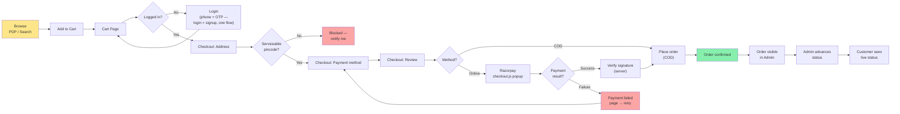
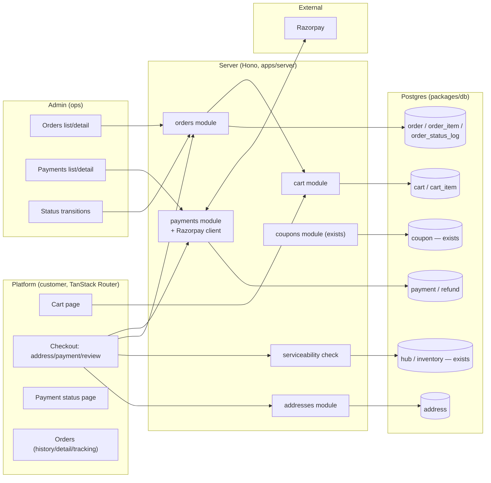
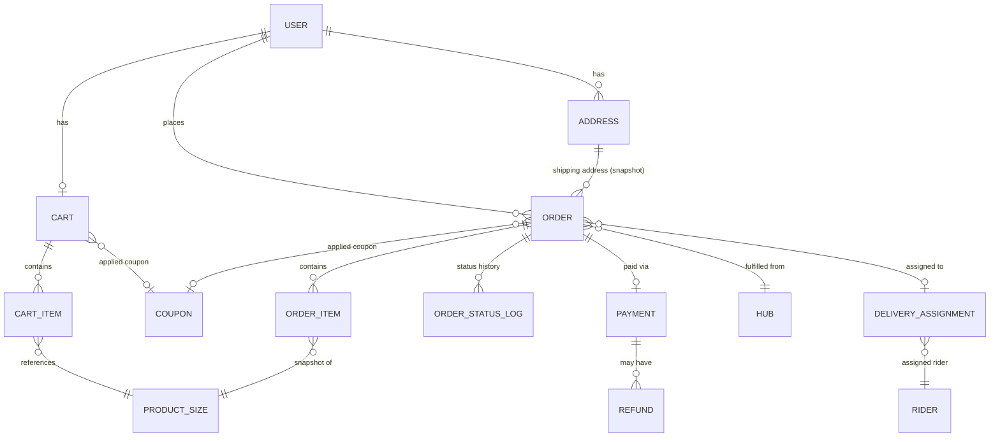
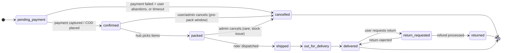
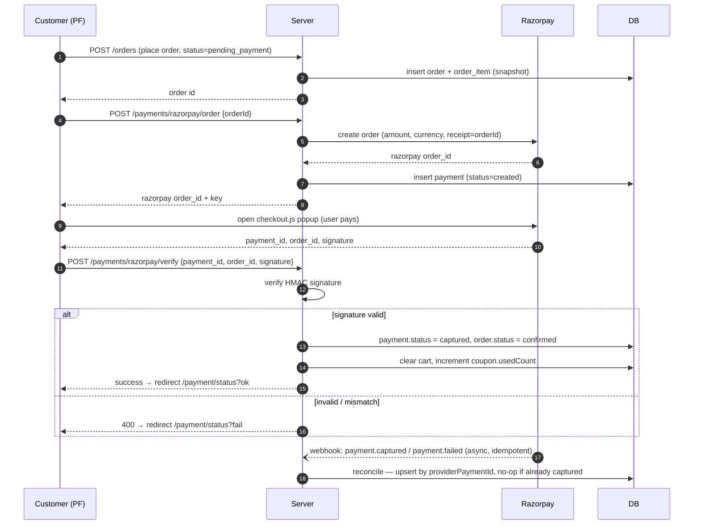
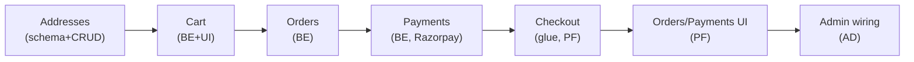

# Mumzo — Order → Checkout Flow (Full Design)

> Deep-dive spec for Cart → Addresses → Checkout → Payment → Order, across **Platform**
> (customer), **Admin** (ops), and **Server** (Hono API + Postgres). Companion to
> [`mumzo_project_plan.md`](./mumzo_project_plan.md) (status tracker) and
> [`mumzo_dev_sprint_plan.md`](./mumzo_dev_sprint_plan.md) (schedule). This doc is the *what to
> build*; the sprint plan is *when*.
>
> **Confirmed current state:** `cart`, `order`, `payment`, `address` tables do **not exist yet** —
> this is greenfield. Server route pattern, coupon schema, and response envelope below are real,
> taken from the current codebase, not invented.

---

## 1. End-to-end flow (horizontal)

---

## 2. Click-by-click user flow (UI interaction level)

Zoomed in from §1 — every tap/click a customer makes, PDP through order confirmation, with the
UI element and the resulting action/API call named.

```mermaid
flowchart LR
    subgraph PDP["Product Detail Page"]
      direction TB
      p1["Tap product card\n(from Home/Search)"]
      p2["PDP loads —\nGET /products/:slug"]
      p3["Select size/variant\n(pill selector)"]
      p4["Tap qty stepper\n(optional, default 1)"]
      p5["Tap 'Add to Cart'"]
      p1 --> p2 --> p3 --> p4 --> p5
    end

    subgraph ADD["Add-to-cart reaction"]
      direction TB
      a1["POST /cart/items"]
      a2["Toast: 'Added to cart'"]
      a3["Header cart badge\ncount increments"]
      a4["Sticky mobile bar\nshows 'View Cart'"]
      a1 --> a2
      a1 --> a3
      a1 --> a4
    end

    subgraph CART["Cart Page"]
      direction TB
      c1["Tap cart icon\n(header) or 'View Cart'"]
      c2["GET /cart —\nitems + live totals"]
      c3["Tap qty +/- on item\n→ PATCH /cart/items/:id"]
      c4["Tap 'Remove'\n→ DELETE /cart/items/:id"]
      c5["Type coupon code,\ntap 'Apply'\n→ POST /cart/coupon"]
      c6["Review price summary\n(subtotal/GST/delivery/total)"]
      c7["Tap 'Proceed to Checkout'\n(disabled if below min order)"]
      c1 --> c2 --> c6 --> c7
      c2 -.-> c3
      c2 -.-> c4
      c2 -.-> c5
    end

    subgraph CKA["Checkout: Address"]
      direction TB
      k1["Redirected to\n/checkout/address"]
      k2{"Saved\naddresses?"}
      k3["Tap an address card\nto select"]
      k4["Tap 'Add new address'\n→ inline form"]
      k5["Fill form, tap 'Save'\n→ POST /addresses"]
      k6["Serviceability check\nruns on selected pincode"]
      k7["Tap 'Continue'"]
      k1 --> k2
      k2 -- yes --> k3 --> k6
      k2 -- no --> k4 --> k5 --> k6
      k6 --> k7
    end

    subgraph CKP["Checkout: Payment"]
      direction TB
      m1["/checkout/payment"]
      m2["Tap a method:\nUPI / Card / Netbanking /\nWallet / COD"]
      m3["Tap 'Continue'"]
      m1 --> m2 --> m3
    end

    subgraph CKR["Checkout: Review"]
      direction TB
      r1["/checkout/review —\nline items, address, method"]
      r2["Tap 'Edit' on any section\n(jumps back, keeps other steps)"]
      r3["Tap 'Place Order'"]
      r1 --> r2
      r1 --> r3
    end

    subgraph PAY["Payment execution"]
      direction TB
      y1{"Method?"}
      y2["COD: order confirmed\nimmediately"]
      y3["Online: POST /orders,\nthen POST /payments/razorpay/order"]
      y4["Razorpay checkout.js\npopup opens"]
      y5["Customer completes\npayment in popup"]
      y6["POST /payments/razorpay/verify"]
      y1 -- COD --> y2
      y1 -- Online --> y3 --> y4 --> y5 --> y6
    end

    subgraph DONE["Confirmation"]
      direction TB
      f1["Redirect to\n/payment/status"]
      f2["Success screen:\norder id, ETA,\n'Track Order' button"]
      f3["Tap 'Track Order'\n→ /orders/:id/tracking"]
      f1 --> f2 --> f3
    end

    p5 --> a1
    a4 --> c1
    c7 --> k1
    k7 --> m1
    m3 --> r1
    r3 --> y1
    y2 --> f1
    y6 --> f1
```

### Step-by-step reference table

| # | Screen | User action | Element | Triggers |
|---|---|---|---|---|
| 1 | Home / Search | Tap a product card | `ProductCard` | Navigate to PDP |
| 2 | PDP | Page loads | — | `GET /products/:slug` |
| 3 | PDP | Tap a size/variant pill | Size selector | Updates selected `productSizeId` + price shown |
| 4 | PDP | Tap qty +/- (optional) | Qty stepper | Local state, defaults to 1 |
| 5 | PDP | Tap "Add to Cart" | Primary CTA | `POST /cart/items` |
| 6 | PDP | — | Toast + header badge + sticky mobile bar | Confirms add, offers "View Cart" |
| 7 | Cart | Tap cart icon or "View Cart" | Header icon / sticky bar | Navigate to `/cart`, `GET /cart` |
| 8 | Cart | Tap qty +/- on a line item | Item card stepper | `PATCH /cart/items/:id` |
| 9 | Cart | Tap "Remove" | Item card | `DELETE /cart/items/:id` |
| 10 | Cart | Type code, tap "Apply" | Coupon input | `POST /cart/coupon`, re-renders totals |
| 11 | Cart | Tap "Proceed to Checkout" | Primary CTA (disabled under min-order) | Navigate to `/checkout/address` |
| 12 | Checkout: Address | Tap a saved address card | Address list | Select as shipping address |
| 13 | Checkout: Address | Tap "Add new address" | Secondary link | Expands inline form |
| 14 | Checkout: Address | Fill fields, tap "Save" | Address form | `POST /addresses`, auto-selects new one |
| 15 | Checkout: Address | — | — | Serviceability check runs against pincode; blocks continue if unserviceable |
| 16 | Checkout: Address | Tap "Continue" | Step footer CTA | Navigate to `/checkout/payment` |
| 17 | Checkout: Payment | Tap a payment method | Method selector (radio cards) | Sets method for review step |
| 18 | Checkout: Payment | Tap "Continue" | Step footer CTA | Navigate to `/checkout/review` |
| 19 | Checkout: Review | Tap "Edit" on address/payment section | Inline edit link | Jumps back one step, preserves other selections |
| 20 | Checkout: Review | Tap "Place Order" | Primary CTA (disabled after first click) | COD → confirm directly; Online → `POST /orders` then Razorpay flow |
| 21 | Payment | (online only) Complete payment in popup | Razorpay checkout.js | Returns `payment_id`/`signature` to app |
| 22 | Payment | — | — | `POST /payments/razorpay/verify`; webhook reconciles async |
| 23 | Confirmation | Page loads | Payment status page | Success: order id + ETA; Failure: retry CTA back to step 17 |
| 24 | Confirmation | Tap "Track Order" | Primary CTA | Navigate to `/orders/:id/tracking` |

---

## 3. System architecture (who owns what)

---

## 4. Data model

**New tables to build** (none exist today):

| Table | Key columns | Notes |
|---|---|---|
| `address` | userId, label, line1, line2, city, state, pincode, lat/lng (nullable), isDefault | Small — plain fields, no map autocomplete for launch |
| `cart` | userId (nullable), guestSessionId (nullable), couponId (nullable) | One active cart per user/guest |
| `cart_item` | cartId, productSizeId, qty | Denormalize price at *display* time only — cart is live, not a snapshot |
| `order` | userId, addressId, status, subtotal, gstAmount, deliveryFee, discount, total, couponId, hubId, placedAt | **Snapshot** address fields onto the order (don't rely on FK alone — user may edit/delete address later) |
| `order_item` | orderId, productId, productSizeId, nameSnapshot, priceSnapshot, qty | Always snapshot name/price — product price can change after order |
| `order_status_log` | orderId, fromStatus, toStatus, actor (`system`/`admin:<id>`/`customer`), note, createdAt | Full audit trail, drives the tracking UI timeline |
| `payment` | orderId, provider (`razorpay`/`cod`), providerOrderId, providerPaymentId, status, amount, method | `status`: `created → authorized → captured → failed`; COD rows created already-`captured`-equivalent (`cod_pending`) |
| `refund` | paymentId, amount, reason, providerRefundId, status | For cancellations/returns after payment captured |

Reused as-is (already exist): `coupon`, `couponProduct`, `couponAssignment`, `productSize`,
`hub`, `inventory`.

> **Coupon dependency flagged in code:** `coupon.usedCount` and `maxUsesPerUser` are placeholders
> today because there's no `order` table to count against — wiring order placement to increment
> `usedCount` and check `maxUsesPerUser` is **part of this build**, not a pre-existing feature.

---

## 5. Order status lifecycle

**Legal transitions are enforced server-side** (`PATCH /admin/orders/:id/status`) — the admin UI
must not allow arbitrary jumps (e.g. `confirmed → delivered` skipping `packed`/`shipped`). Every
transition writes an `order_status_log` row.

---

## 6. Payment sequence (Razorpay online path)

**Why both verify-on-return AND webhook:** the popup callback can be lost (tab closed, network
drop) — the webhook is the source of truth; the synchronous verify is just for fast UI feedback.
Webhook handler must be **idempotent** (check `providerPaymentId` before writing) since Razorpay
retries webhooks.

---

## 7. Checkout flow — screen by screen

```mermaid
flowchart LR
    subgraph S1["Step 1: Address"]
      direction TB
      s1a["List saved addresses"]
      s1b["Select one"]
      s1c["Add new (inline form)"]
      s1d["Serviceability check\non pincode"]
    end
    subgraph S2["Step 2: Payment method"]
      direction TB
      s2a["UPI / Card / Netbanking / Wallet\n(Razorpay)"]
      s2b["Cash on Delivery"]
      s2c["Show COD fee if any"]
    end
    subgraph S3["Step 3: Review"]
      direction TB
      s3a["Line items"]
      s3b["Address + edit link"]
      s3c["Payment method + edit link"]
      s3d["Coupon applied"]
      s3e["Persistent price summary"]
      s3f["Place Order button"]
    end
    S1 --> S2 --> S3 --> Place["Place order\n→ pay/verify\n→ confirmation"]
```

- Order summary sidebar is **persistent** across all 3 steps (same component, not re-fetched
  per step) — avoids total flicker/mismatch between steps.
- Back-navigation between steps must preserve prior selections (address/method chosen), not
  reset.

---

## 8. Edge cases & failure modes (full matrix)

### Cart

| Case | Expected behavior |
|---|---|
| Add item already at max cart qty (stock limit) | Block increment, toast "only N left" |
| Item goes out of stock while sitting in cart | Flag item OOS on cart load (re-check stock on `GET /cart`), block checkout until removed |
| Price changes while item in cart (admin edits product price) | Cart always shows *current* live price, not stale — cart is not a snapshot |
| Guest adds to cart, then logs in with an account that already has items | Merge: sum quantities for shared items, keep both for distinct items, dedupe by productSizeId |
| Guest adds to cart, logs into account with an *empty* cart | Guest cart becomes the user cart wholesale |
| Cart below minimum order value | "Proceed to checkout" disabled, show ₹X more to unlock |
| Apply coupon, then remove item that made cart eligible | Re-validate coupon on every cart mutation; auto-remove coupon + toast if no longer eligible |
| Apply two coupons | Blocked unless `isStackable` on both — enforce server-side, not just UI |
| Coupon `firstOrderOnly` on a user with prior orders | Reject at apply time with clear message |
| Coupon expired between "apply" and "place order" | Re-validate coupon server-side at order placement, not just at cart-apply time |
| Cart sits idle for days (stale stock/price) | Re-validate stock + recompute totals at checkout entry, not just at cart page load |
| Empty cart, user navigates directly to `/checkout` | Redirect to `/cart` |

### Addresses

| Case | Expected behavior |
|---|---|
| No saved addresses, first-time checkout | Show "add new" form directly, skip the list step |
| Invalid pincode format | Client + server Zod validation (6-digit), inline field error |
| Pincode not serviceable | Block at address-select, not later at payment — show "not deliverable here, notify me" |
| Delete the only default address | Auto-promote another address to default, or force-select if none left |
| Edit address mid-checkout | Updates the draft selection, doesn't silently change past orders (orders snapshot address) |

### Checkout / Orders

| Case | Expected behavior |
|---|---|
| Two tabs, place order from both | Idempotency: server-side lock on cart or use a client-generated idempotency key for `POST /orders` |
| Stock sold out between cart and place-order | Re-validate stock inside the order-placement transaction; reject with specific item(s) named |
| User double-clicks "Place Order" | Disable button on click, idempotency key prevents duplicate order rows |
| Session expires mid-checkout | Redirect to login with `?redirect=/checkout/review`, preserve cart (cart is server-side, not lost) |
| Browser back after placing order | Order already created — back button must not resubmit; use redirect-after-POST (PRG pattern) |
| Cancel order after `packed` | Blocked — window closed, show "contact support" instead of cancel button |
| Cancel window logic | Configurable cutoff (e.g. cancellable only while `pending_payment`/`confirmed`) |

### Payments

| Case | Expected behavior |
|---|---|
| Razorpay popup closed without paying | Order stays `pending_payment`; show retry on payment-status page, don't auto-cancel immediately |
| Payment succeeds but verify-signature call fails (network drop) | Webhook still lands and reconciles — order eventually moves to `confirmed`; poll or show "processing" state to user meanwhile |
| Payment captured twice (webhook + manual verify both fire) | Idempotent write keyed on `providerPaymentId` — second write is a no-op |
| Payment fails (insufficient funds, card declined) | `payment.status = failed`, order stays `pending_payment`, retry re-uses same order (new Razorpay order id) |
| Amount tampering attempt (client sends different amount than server computed) | Server always recomputes total server-side for the Razorpay order create call — never trust client-sent amount |
| COD order — customer refuses at door | Admin marks `returned`/`cancelled` with reason, no refund flow needed (never charged) |
| Refund requested on a captured payment | `POST /admin/payments/:id/refund` → Razorpay refund API → `refund` row, async webhook confirms |
| Webhook signature invalid / spoofed request | Reject 400, log, do not process — verify Razorpay webhook secret HMAC on every call |
| Currency/rounding mismatch (paise vs rupees) | Store all money as integer paise end-to-end; convert to rupees only at display layer |

### Admin

| Case | Expected behavior |
|---|---|
| Admin tries illegal status jump (e.g. `confirmed → delivered`) | Server rejects, only legal transitions per the state diagram (§4) allowed |
| Two admins edit the same order simultaneously | Last-write-wins is acceptable for v1, but log `actor` on every status change for traceability |
| Admin cancels an already-`shipped` order | Requires explicit override reason, flagged differently from a clean pre-pack cancel |
| Filter orders by date/status/user on large dataset | Paginate server-side (`?page&limit`), don't fetch-all-then-filter client-side |
| Order has no rider assigned and moves to `shipped` | Should be structurally impossible — require `delivery_assignment` before allowing `shipped` transition (soft dependency on M13, can stub with a manual field for launch) |

### Minor / cross-cutting

| Case | Expected behavior |
|---|---|
| GST calculation | Flat 5% on subtotal, shown as its own line, computed server-side only |
| Free delivery threshold | Nudge shown in cart ("₹X more for free delivery"), fee zeroed server-side when subtotal crosses threshold |
| Delivery slot (10-min express only for v1) | No scheduled-slot UI needed yet — hardcode express, structure the field so scheduled slots can be added later without a schema change |
| Order placed just before midnight / invoice numbering | Sequential invoice numbers reset by financial year — stub simple sequential ids for now since GST invoicing itself is descoped to fast-follow |
| Currency display | Always ₹, `Intl.NumberFormat("en-IN")` for grouping (₹1,23,456) |
| Empty states | Cart empty, no orders yet, no addresses — each needs a real `Empty` component state, not a blank screen |
| Network failure mid-flow | Every mutation (add to cart, place order, verify payment) needs a retry affordance, not just a toast-and-forget |

---

## 9. API surface (new endpoints to build)

Following the existing Hono pattern (`modules/<app>/v1/<domain>/{module,routes,schema,service}.ts`,
response envelope `{success, data, message}` / `{success, error:{code,message}}` from
`apps/server/src/core/response.ts`).

| Method | Path | Purpose |
|---|---|---|
| `GET/POST/PATCH/DELETE` | `/api/v1/addresses` | Address CRUD + set-default |
| `GET` | `/api/v1/cart` | Get cart w/ computed totals |
| `POST` | `/api/v1/cart/items` | Add item |
| `PATCH/DELETE` | `/api/v1/cart/items/:id` | Update qty / remove |
| `POST/DELETE` | `/api/v1/cart/coupon` | Apply / remove coupon |
| `DELETE` | `/api/v1/cart` | Clear cart |
| `GET` | `/api/v1/serviceability/:pincode` | Serviceability check |
| `POST` | `/api/v1/orders` | Place order (creates `pending_payment` order) |
| `GET` | `/api/v1/orders` | List current user's orders (paginated) |
| `GET` | `/api/v1/orders/:id` | Order detail + status timeline |
| `POST` | `/api/v1/orders/:id/cancel` | Cancel (if window open) |
| `POST` | `/api/v1/orders/:id/cod` | Confirm COD order (no gateway) |
| `POST` | `/api/v1/payments/razorpay/order` | Create Razorpay order for a Mumzo order |
| `POST` | `/api/v1/payments/razorpay/verify` | Verify signature, confirm order |
| `POST` | `/api/v1/payments/webhook` | Razorpay async webhook (public, signature-verified) |
| `GET` | `/admin/orders` | List all orders, filterable |
| `GET` | `/admin/orders/:id` | Order detail (admin view) |
| `PATCH` | `/admin/orders/:id/status` | Status transition (validated) |
| `GET` | `/admin/payments` | List payments, filterable |
| `GET` | `/admin/payments/:id` | Payment detail |
| `POST` | `/admin/payments/:id/refund` | Trigger refund |

---

## 10. Non-functional / minor build notes

- **Money as integer paise** everywhere server-side and in the DB; format to ₹ only at render time.
- **Idempotency keys** on `POST /orders` and `POST /payments/razorpay/verify` to survive
  double-clicks and retried requests.
- **Server-recomputed totals always** — client-sent amounts are never trusted for payment amount.
- **Audit trail** — every order status change and every payment state change is logged
  (`order_status_log`, `payment.status` history via updatedAt at minimum).
- **PRG pattern** on place-order (redirect after POST) so back-button doesn't resubmit.
- **Webhook idempotency** — Razorpay retries webhooks; dedupe on `providerPaymentId`.
- **Cart is live, orders are snapshots** — this single rule resolves most of the "price changed"
  / "product renamed" class of bugs above.

---

## 11. Build order (maps to sprint plan Phase 1)

See [`mumzo_dev_sprint_plan.md`](./mumzo_dev_sprint_plan.md) §3 for this mapped to actual dates
(Jul 29 – Aug 1).
