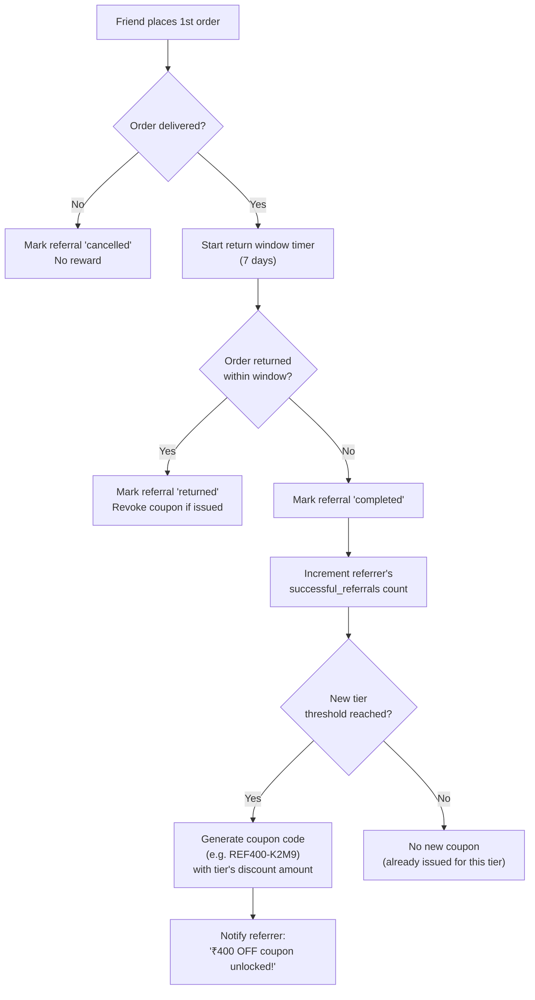

# Mumzo — Tier-Based Referral System (Final Spec)

> All UI decisions below reference
> [`design-system.md`](file:///home/bikram/Desktop/Work/mumzo/mumzo_app/docs/platform/design-system.md)
> and
> [`design-rules.md`](file:///home/bikram/Desktop/Work/mumzo/mumzo_app/docs/rules/design-rules.md).
> No ad-hoc tokens. Every class, color, font, and radius maps to a defined
> semantic token or brand accent.

---

## 1. Overview

Refer & Earn: moms invite friends to Mumzo. Each friend who signs up and places a first order earns the referrer a **coupon code** for discount off their next order. Rewards grow with milestones: 1, 3, 5, and 10 successful referrals.

### Key Design Decisions

- **Rewards = Coupon codes**, not wallet credit. Each milestone tier generates a unique single-use coupon (`REF150-8X92K`) the referrer can apply at checkout.
- **Coupon issued after return period**, not on delivery. The system waits for the return window to close (7 days after delivery) before generating the coupon.
- **If order is returned** during the window → referral status reverts, no coupon is issued. If the coupon was already issued (edge case) → coupon is **revoked** (marked invalid).
- **3-stage invite tracking**: Link Shared → Signed Up → Order Placed. Clean, simple, no over-engineering.

---

## 2. Tier & Reward Matrix

| Tier | Milestone | Referrer Coupon | Friend Gets |
|---|---|---|---|
| **Tier 1** | **1** successful referral | **₹150 OFF** next order | ₹150 OFF 1st order |
| **Tier 2** | **3** successful referrals | **₹400 OFF** next order | ₹150 OFF 1st order |
| **Tier 3** | **5** successful referrals | **₹600 OFF** next order | ₹150 OFF 1st order |
| **Tier 4** | **10** successful referrals | **₹2,000 OFF** next order | ₹150 OFF 1st order |

> [!NOTE]
> Tier rewards are **milestone rewards**, not per-referral. Reaching 3 successful referrals gives one ₹400 coupon (not 3 × ₹150). The referrer also gets the Tier 1 coupon at referral #1.

---

## 3. Invite Tracking — 3 Stages

Each invited friend is tracked through exactly 3 stages:

```
1. 🔗 Link Shared         Friend hasn't acted yet.
       │
       ▼
2. 👤 Signed Up           Friend created account using the referral code.
       │
       ▼
3. 🛒 Order Placed        Friend placed their first order.
       │
       ├── Return window passes (7 days) ──→ ✅ Completed → Coupon issued
       │
       └── Order returned / fully refunded ──→ ❌ Returned → No coupon / revoked
```

### Status Definitions

| Status | Key | What happened | Coupon? |
|---|---|---|---|
| Link Shared | `link_shared` | Code/link was shared (tracked via link click or manual entry) | No |
| Signed Up | `signed_up` | Friend registered with the referral code | No |
| Order Placed | `order_placed` | Friend's 1st order is confirmed (payment done) | No — waiting |
| Completed | `completed` | Return window expired, order not returned | **Yes — coupon generated** |
| Returned | `returned` | Order was returned/refunded within window | **No — revoked if issued** |

---

## 4. Settlement Engine — Coupon Issuance Flow



### Settlement Rules

1. **Timer trigger**: A scheduled job (cron or event-driven) checks orders where `delivered_at + RETURN_WINDOW_DAYS < now()` and the referral status is still `order_placed`.
2. **On window expiry (no return)**:
   - Update referral → `completed`, set `completedAt`.
   - Increment `userReferralCodes.successfulReferrals`.
   - Check if any new tier threshold is crossed (1, 3, 5, 10).
   - For each newly crossed tier → generate a unique coupon code with that tier's `discountAmount`, insert into `referralCoupons`.
   - Send push notification / in-app toast to referrer.
3. **On return within window**:
   - Update referral → `returned`.
   - If a coupon was somehow already issued (race condition) → mark it `revoked`.
   - Decrement `successfulReferrals` if it was incremented.
4. **Coupon properties**: Single-use, expires in 90 days, no minimum order amount, non-stackable with other referral coupons.

---

## 5. Database Schema (`packages/db/src/schema/referrals.ts`)

```ts
import { boolean, integer, pgTable, text, timestamp } from "drizzle-orm/pg-core";
import { user } from "./auth";
import { generateId } from "../utils";

/** Referral tier configuration — managed by SuperAdmin */
export const referralTiers = pgTable("referral_tiers", {
  id:             text("id").primaryKey().$defaultFn(() => generateId("reftier")),
  name:           text("name").notNull(),                  // "First Invite"
  threshold:      integer("threshold").notNull().unique(),  // 1, 3, 5, 10
  discountAmount: integer("discount_amount").notNull(),     // 150, 400, 600, 2000
  blurb:          text("blurb").notNull(),                  // "₹150 off your next order"
  isActive:       boolean("is_active").default(true).notNull(),
  sortOrder:      integer("sort_order").default(0).notNull(),
  createdAt:      timestamp("created_at").defaultNow().notNull(),
  updatedAt:      timestamp("updated_at").defaultNow().notNull(),
});

/** One row per user — their unique referral code and running count */
export const userReferralCodes = pgTable("user_referral_codes", {
  id:                   text("id").primaryKey().$defaultFn(() => generateId("refcode")),
  userId:               text("user_id").notNull().references(() => user.id, { onDelete: "cascade" }).unique(),
  code:                 text("code").notNull().unique(),    // "ANANYA150"
  successfulReferrals:  integer("successful_referrals").default(0).notNull(),
  createdAt:            timestamp("created_at").defaultNow().notNull(),
});

/** Each referral relationship — one row per invited friend */
export const referrals = pgTable("referrals", {
  id:              text("id").primaryKey().$defaultFn(() => generateId("ref")),
  referrerUserId:  text("referrer_user_id").notNull().references(() => user.id),
  refereeUserId:   text("referee_user_id").references(() => user.id), // null until signup
  codeUsed:        text("code_used").notNull(),
  // "link_shared" | "signed_up" | "order_placed" | "completed" | "returned" | "cancelled"
  status:          text("status").default("link_shared").notNull(),
  firstOrderId:    text("first_order_id"),
  deliveredAt:     timestamp("delivered_at"),
  returnWindowEnd: timestamp("return_window_end"),  // delivered_at + 7 days
  completedAt:     timestamp("completed_at"),
  createdAt:       timestamp("created_at").defaultNow().notNull(),
  updatedAt:       timestamp("updated_at").defaultNow().notNull(),
});

/** Coupons issued as referral rewards — one per tier milestone reached */
export const referralCoupons = pgTable("referral_coupons", {
  id:             text("id").primaryKey().$defaultFn(() => generateId("refcoup")),
  userId:         text("user_id").notNull().references(() => user.id),
  tierId:         text("tier_id").notNull().references(() => referralTiers.id),
  couponCode:     text("coupon_code").notNull().unique(),  // "REF150-8X92K"
  discountAmount: integer("discount_amount").notNull(),     // 150, 400, 600, 2000
  // "active" | "used" | "expired" | "revoked"
  status:         text("status").default("active").notNull(),
  usedInOrderId:  text("used_in_order_id"),
  expiresAt:      timestamp("expires_at").notNull(),       // created_at + 90 days
  createdAt:      timestamp("created_at").defaultNow().notNull(),
});
```

---

## 6. API Endpoints

### Public (No Auth)

| Method | Path | Description |
|---|---|---|
| `GET` | `/api/v1/referrals/program` | Returns active tiers (1/3/5/10), rewards, FAQs. Powers the public `/referrals` page. |
| `GET` | `/api/v1/referrals/validate/:code` | Validates a referral code exists and is active. Used on referee link landing & checkout. |
| `POST` | `/api/v1/referrals/track-click` | Records a `link_shared` referral row when a friend clicks the referral link (`/r/:code`). |

### Authenticated (Customer)

| Method | Path | Description |
|---|---|---|
| `GET` | `/api/v1/referrals/me` | Returns user's code, successful count, current tier, coupons, and invite list with statuses. |
| `GET` | `/api/v1/referrals/me/coupons` | Returns all issued referral coupons (active, used, expired, revoked). |

### Internal (Server-to-Server / Webhooks)

| Trigger | Action |
|---|---|
| **User signs up with referral code** | Update referral row → `signed_up`, link `refereeUserId`. |
| **Referee places 1st order** | Update referral → `order_placed`, set `firstOrderId`. |
| **Order delivered** | Set `deliveredAt`, compute `returnWindowEnd` (delivered + 7 days). |
| **Return window cron job** | For each referral where `status = 'order_placed'` and `returnWindowEnd < now()`: settle → `completed`, issue coupon. |
| **Order returned** | If referral status is `order_placed` → mark `returned`. If coupon was issued → mark coupon `revoked`. |

### SuperAdmin

| Method | Path | Description |
|---|---|---|
| `GET` | `/api/v1/admin/referrals/tiers` | List all tier configs. |
| `PUT` | `/api/v1/admin/referrals/tiers/:id` | Update tier thresholds, amounts, blurbs. |
| `GET` | `/api/v1/admin/referrals/stats` | Dashboard stats: total referrals, conversion rate, coupons issued, fraud flags. |
| `GET` | `/api/v1/admin/referrals/list` | Paginated list of all referral records with filters (status, date range). |

---

## 7. Frontend Architecture — Aligned to Design System

### 7.1 Route Changes

Move `/referrals` from `(protected)` to public `(store)`:

```diff
  apps/platform/src/pages/(store)/
+   referrals.tsx              # Public page (Guest CTA + Auth dashboard)
+   r/$code.tsx                # Referral link landing (/r/ANANYA150)
- apps/platform/src/pages/(store)/(protected)/
-   referrals.tsx              # OLD: delete after migration
```

### 7.2 Module Structure

```
modules/referrals/
  components/
    referral-hero.tsx          # Hero banner (Guest CTA vs Auth code card)
    tier-ladder.tsx             # Interactive milestone rungs (EXISTING — update types)
    coupon-list.tsx             # Earned coupons with status badges
    invite-tracker.tsx          # Per-friend 3-stage progress feed
    referral-faq.tsx            # Accordion
    referral-offers.tsx         # EXISTING — keep as-is
  api/
    referrals-api.ts           # TanStack Query wrappers
  data/
    referral-data.ts           # Types, mock data, helpers (update types)
```

---

### 7.3 Design Token Mapping — Per Component

> Every class below is sourced from
> [`design-system.md`](file:///home/bikram/Desktop/Work/mumzo/mumzo_app/docs/platform/design-system.md).
> No raw hex, no ad-hoc colors, no arbitrary values.

---

#### `referral-hero.tsx` — Hero Banner

The hero section of the referrals page. Follows the existing pattern in
[referrals.tsx](file:///home/bikram/Desktop/Work/mumzo/mumzo_app/apps/platform/src/pages/%28store%29/%28protected%29/referrals.tsx#L56-L98).

| Element | Token / Class | Why |
|---|---|---|
| Container | `rounded-3xl border border-border/60 bg-accent/40 p-8` | Cards use `rounded-3xl` (design-system §Radius). `bg-accent` = peach (`#FDE2CE`) as warm wash (design-system §Brand accents). Same as existing hero `bg-blush/40` → switch to `bg-accent/40` (peach, not legacy pink). |
| Kicker label | `.kicker text-primary` | Design-system §Typography: `.kicker` class = uppercase, wide tracking, navy. |
| Headline | `font-editorial text-4xl text-ink leading-tight tracking-tight sm:text-5xl` | **Fraunces** via `font-editorial`. `text-ink` = navy `#1F1B3A`. Tight tracking per design-system §Typography. |
| Body copy | `text-foreground/70 leading-relaxed` | Body in **Manrope** (default `font-sans`). `text-foreground` = navy at 70% opacity for secondary text. |
| Referral code badge | `rounded-2xl border border-primary/30 border-dashed bg-card px-5 py-3 font-editorial text-2xl text-ink tracking-wide` | `bg-card` = `#FFFFFF` (design-system §Color). Dashed border with `border-primary/30` (navy 30%). Fraunces for the code display. |
| Copy button | `rounded-full border border-border bg-card px-5 py-3 font-semibold text-muted-foreground text-sm transition-colors hover:bg-secondary` | **Pill shape** (`rounded-full`, design-system §Radius: "Buttons → pill"). `bg-card` to `hover:bg-secondary`. `text-muted-foreground` = `#5A566E`. |
| Share on WhatsApp button | `rounded-full bg-primary px-5 py-3 font-semibold text-primary-foreground text-sm transition-colors hover:bg-primary/90` | Navy pill CTA. `bg-primary` = `#1F1B3A`, `text-primary-foreground` = `#FDFBF7`. Matches `.mumzo-btn` pattern. |
| Current reward text | `text-muted-foreground text-sm` with inner `font-semibold text-ink` | Meta caption in muted, emphasis in navy. |

**Guest state** (logged out):
- Same container styling. Replace code badge + buttons with a single CTA:
  `rounded-full bg-primary px-6 py-3 font-semibold text-primary-foreground` → "Sign up to start referring"
- Tier ladder still visible but all tiers show `Lock` icon.

---

#### `tier-ladder.tsx` — Reward Milestone Rungs

Already exists at [tier-ladder.tsx](file:///home/bikram/Desktop/Work/mumzo/mumzo_app/apps/platform/src/modules/referrals/components/tier-ladder.tsx). Update types from `credit/percent/free_delivery` → `coupon`, keep visual patterns.

| Element | Token / Class | Why |
|---|---|---|
| Outer container | `rounded-3xl border border-border/60 bg-card p-6` | `bg-card` = `#FFFFFF` surface. `rounded-3xl` per cards/panels rule. |
| Section heading | `font-editorial text-ink text-xl` | Fraunces, navy. Matches existing. |
| Progress caption | `text-muted-foreground text-sm` with `font-semibold text-ink` for counts | Muted `#5A566E` for meta, navy `#1F1B3A` for emphasis. |
| Active tier rung | `border-primary/40 bg-accent/15` | Peach wash at 15% for active. Switch from `bg-blush/30` (legacy pink) → `bg-accent/15` (peach). |
| Next tier rung | `border-primary/20 bg-sage/10` | Sage wash at 10% for "coming next" — calm, nurturing. |
| Locked tier rung | `border-border/60 bg-secondary/30` | Secondary cream fill for locked. |
| Unlocked check circle | `bg-primary text-primary-foreground rounded-full size-9` | Navy circle, cream check. |
| Locked icon circle | `bg-card text-foreground/40 rounded-full size-9` | White circle, faded navy lock. |
| Tier name | `font-semibold text-ink text-sm` | Manrope bold, navy. |
| Threshold badge | `rounded-full bg-card px-2 py-0.5 font-semibold text-[11px] text-muted-foreground` | Pill badge. |
| Reward display | `font-editorial text-ink text-sm` | Fraunces for reward amount (e.g. "₹400 off coupon"). |

---

#### `coupon-list.tsx` — Earned Referral Coupons (NEW)

Displays the user's earned coupon codes with status. Uses `@mumzo/ui` `Badge` component for statuses.

| Element | Token / Class | Why |
|---|---|---|
| Section heading | `font-editorial text-ink text-xl` | Consistent with all section heads on the page. |
| Coupon card | `rounded-2xl border border-border/60 bg-card p-4 flex items-center gap-4` | Card surface, standard radius. |
| Coupon code display | `font-editorial text-ink text-lg tracking-wide` | Fraunces for code. Prominent. |
| Discount amount | `font-editorial text-ink text-2xl` | Large Fraunces, e.g. "₹400 OFF". |
| Status: Active | `Badge` with `variant="default"` → `bg-primary text-primary-foreground` | Navy badge = active/usable. |
| Status: Used | `Badge` with `variant="secondary"` → `bg-secondary text-muted-foreground` | Muted/cream = already used. |
| Status: Expired | `Badge` with `variant="outline"` → `border-border text-muted-foreground` | Outlined = expired, faded. |
| Status: Revoked | `Badge` with `variant="destructive"` → `bg-destructive text-destructive-foreground` | Red = revoked (`#C0392B`). |
| Expiry date | `text-muted-foreground text-xs` | Muted caption. |
| Copy coupon button | Same pattern as existing code copy: `rounded-full border border-border bg-card px-4 py-2 text-sm transition-colors hover:bg-secondary` | Pill, copy interaction with `sonner` toast. |
| Empty state | Use `@mumzo/ui` empty-state pattern: icon + `text-muted-foreground text-sm` + `font-editorial text-ink` heading | "No coupons yet. Start referring friends!" |

---

#### `invite-tracker.tsx` — 3-Stage Friend Progress (NEW)

Per-friend tracking feed showing the 3-stage funnel: Link Shared → Signed Up → Order Placed.

| Element | Token / Class | Why |
|---|---|---|
| Section heading | `font-editorial text-ink text-xl` | Consistent. |
| Friend card | `rounded-3xl border border-border/60 bg-card p-4 flex items-center gap-4` | Matches existing invite card pattern from [referrals.tsx L118](file:///home/bikram/Desktop/Work/mumzo/mumzo_app/apps/platform/src/pages/%28store%29/%28protected%29/referrals.tsx#L118). |
| Avatar circle | `size-10 rounded-full bg-accent/40 text-ink font-semibold text-sm flex items-center justify-center` | Peach wash avatar with navy initial. Matches existing pattern. |
| Friend name | `font-semibold text-ink text-sm` | Manrope bold, navy. |
| Status note | `text-muted-foreground text-xs` | Muted caption. |
| **Stage dots** (3-step indicator) | Three circles with connecting lines: | |
| • Completed stage dot | `size-3 rounded-full bg-primary` | Navy filled dot. |
| • Current stage dot | `size-3 rounded-full bg-accent ring-2 ring-primary/30` | Peach dot with navy ring = currently here. |
| • Pending stage dot | `size-3 rounded-full bg-secondary` | Cream dot = not yet reached. |
| Connecting line (completed) | `h-0.5 bg-primary flex-1` | Navy line between completed dots. |
| Connecting line (pending) | `h-0.5 bg-border flex-1` | Border-color line between pending dots. |
| Stage label | `text-muted-foreground text-[10px]` | Tiny caption below each dot. |
| Status badges (tint mapping) | | |
| • `link_shared` | `bg-accent/50 text-ink` | Warm peach wash. |
| • `signed_up` | `bg-cream text-ink` | Soft cream. |
| • `order_placed` | `bg-sage/60 text-ink` | Sage green = in progress, calm. |
| • `completed` | `bg-primary/10 text-ink` | Subtle navy wash = done. |
| • `returned` | `bg-destructive/10 text-destructive` | Faded red = returned. Uses `--destructive` (`#C0392B`). |

---

#### `referral-faq.tsx` — Accordion (NEW)

Uses the `@mumzo/ui` `Accordion` component. No custom markup.

| Element | Token / Class | Why |
|---|---|---|
| Outer wrapper | `rounded-3xl border border-border/60 bg-card p-6` | Standard card container. |
| Section heading | `font-editorial text-ink text-xl` | Consistent heading. |
| Accordion trigger | Default shadcn styling — `text-ink font-semibold text-sm` | Navy text, Manrope. |
| Accordion content | `text-muted-foreground text-sm leading-relaxed` | Muted body. |
| `Separator` between sections | `@mumzo/ui` `Separator` component | Not `<hr>`. Design-rules §4. |

**FAQ content (static mock)**:
1. "How does the referral programme work?"
2. "When do I get my coupon?"
3. "What happens if my friend returns their order?"
4. "Can I use multiple referral coupons on one order?"
5. "Do referral coupons expire?"

---

### 7.4 Referral Link Landing — `/r/$code.tsx` (NEW)

When a friend clicks a referral link like `/r/ANANYA150`:

| Element | Token / Class | Why |
|---|---|---|
| Page background | `bg-background` | Warm cream `#FDFBF7`. |
| Card | `rounded-3xl bg-card shadow-warm p-8 max-w-md mx-auto mt-16` | White card, warm shadow, generous padding. |
| Heading | `font-editorial text-ink text-3xl tracking-tight` | "You've been invited!" in Fraunces. |
| Referrer mention | `font-accent text-primary text-lg` | **Caveat** (hand-drawn) for the referrer's name — "by Ananya". Sparingly, as per design-system. |
| Benefit callout | `rounded-2xl bg-accent/30 p-4 text-center` | Peach wash card. "₹150 off your first order". |
| Amount | `font-editorial text-ink text-4xl` | Large Fraunces number. |
| Sign up CTA | `rounded-full bg-primary px-8 py-3 font-semibold text-primary-foreground text-base transition-colors hover:bg-primary/90` | Navy pill button = primary CTA. |
| Already have an account | `text-muted-foreground text-sm` link → sign-in | Muted link. |

---

### 7.5 Page Layout — Authenticated Referrals

```
┌────────────────────────────────────────────────────────────────────┐
│  Breadcrumbs: Home / Refer & earn                                  │
├────────────────────────────────────────────────────────────────────┤
│  ┌─── Hero (bg-accent/40) ──────────┐  ┌─── Tier Ladder ────────┐ │
│  │ .kicker: "Refer & earn"          │  │ font-editorial heading │ │
│  │ font-editorial h1                │  │ 4 tier rungs           │ │
│  │ body copy                        │  │ (check/lock, reward)   │ │
│  │ [CODE] [Copy] [Share WhatsApp]   │  │                        │ │
│  │ "Currently earning ₹400 OFF…"    │  │                        │ │
│  └──────────────────────────────────┘  └────────────────────────┘ │
│                                                                    │
│  ┌─── Coupons (bg-card) ────────────────────────────────────────┐ │
│  │ font-editorial "Your coupons"                                │ │
│  │ ┌── REF150-8X92K ──┬── ₹150 OFF ──┬── Badge: Used ──┐      │ │
│  │ └──────────────────┴──────────────┴──────────────────┘      │ │
│  │ ┌── REF400-K2M9 ──┬── ₹400 OFF ──┬── Badge: Active ┐      │ │
│  │ └──────────────────┴──────────────┴──────────────────┘      │ │
│  └──────────────────────────────────────────────────────────────┘ │
│                                                                    │
│  ┌─── Offers to Share (existing component) ─────────────────────┐ │
│  └──────────────────────────────────────────────────────────────┘ │
│                                                                    │
│  ┌─── Invite Tracker (bg-card) ─────────────────────────────────┐ │
│  │ font-editorial "Your invites"                                │ │
│  │ ┌── Meera ─── ●━━━●━━━● ─── Completed ──────────────┐      │ │
│  │ ┌── Kavya ─── ●━━━●───○ ─── Signed Up ──────────────┐      │ │
│  │ ┌── Divya ─── ●───○───○ ─── Link Shared ────────────┐      │ │
│  └──────────────────────────────────────────────────────────────┘ │
│                                                                    │
│  ┌─── FAQ Accordion (bg-card) ──────────────────────────────────┐ │
│  └──────────────────────────────────────────────────────────────┘ │
└────────────────────────────────────────────────────────────────────┘
```

---

### 7.6 Data Layer Updates (`referral-data.ts`)

Update the existing [referral-data.ts](file:///home/bikram/Desktop/Work/mumzo/mumzo_app/apps/platform/src/modules/referrals/data/referral-data.ts) types:

```diff
- export type RewardKind = "credit" | "percent" | "free_delivery";
- export type ReferralReward =
-   | { kind: "credit"; amount: number }
-   | { kind: "percent"; value: number; cap: number | null }
-   | { kind: "free_delivery"; count: number };
+ /** Referral rewards are always coupon codes for a fixed discount amount. */
+ export type ReferralReward = {
+   kind: "coupon";
+   /** Discount amount in whole rupees. */
+   amount: number;
+ };

- export type ReferralInviteStatus = "invited" | "joined" | "rewarded";
+ export type ReferralInviteStatus =
+   | "link_shared"
+   | "signed_up"
+   | "order_placed"
+   | "completed"
+   | "returned";

+ /** A coupon issued to the referrer for reaching a tier milestone. */
+ export type ReferralCoupon = {
+   id: string;
+   code: string;           // "REF150-8X92K"
+   discountAmount: number; // 150, 400, 600, 2000
+   status: "active" | "used" | "expired" | "revoked";
+   expiresAt: string;      // ISO date
+   usedAt?: string;
+ };

  export type ReferralProgram = {
    code: string;
    successfulReferrals: number;
    tiers: ReferralTier[];
-   offers: ReferralOffer[];
+   offers: ReferralOffer[];
+   coupons: ReferralCoupon[];
    invites: ReferralInvite[];
  };

  export const INVITE_STATUS_META: Record<
    ReferralInviteStatus,
    { label: string; tint: string }
  > = {
-   invited: { label: "Invited", tint: "bg-accent/50 text-ink" },
-   joined: { label: "Joined", tint: "bg-cream text-ink" },
-   rewarded: { label: "Rewarded", tint: "bg-sage/60 text-ink" },
+   link_shared: { label: "Link Shared", tint: "bg-accent/50 text-ink" },
+   signed_up:   { label: "Signed Up",   tint: "bg-cream text-ink" },
+   order_placed:{ label: "Order Placed", tint: "bg-sage/60 text-ink" },
+   completed:   { label: "Completed",    tint: "bg-primary/10 text-ink" },
+   returned:    { label: "Returned",     tint: "bg-destructive/10 text-destructive" },
  };
```

Update `describeReward`:
```diff
  export function describeReward(reward: ReferralReward): string {
-   switch (reward.kind) {
-     case "credit":
-       return `₹${reward.amount} credit`;
-     case "percent":
-       return reward.cap ? `${reward.value}% off (up to ₹${reward.cap})` : `${reward.value}% off`;
-     case "free_delivery":
-       return `${reward.count} free deliveries`;
-   }
+   return `₹${reward.amount} OFF coupon`;
  }
```

Update tiers to match new rewards:
```ts
tiers: [
  { id: "t1", name: "First invite",      threshold: 1,  reward: { kind: "coupon", amount: 150 },  blurb: "₹150 off your next order." },
  { id: "t2", name: "Getting the word out", threshold: 3, reward: { kind: "coupon", amount: 400 },  blurb: "₹400 off — three friends onboard." },
  { id: "t3", name: "Mumzo champion",    threshold: 5,  reward: { kind: "coupon", amount: 600 },  blurb: "₹600 off — you're a proper champion now." },
  { id: "t4", name: "Community builder",  threshold: 10, reward: { kind: "coupon", amount: 2000 }, blurb: "₹2,000 off — community builder unlocked." },
],
```

---

## 8. Fraud Prevention

1. **Self-referral block**: Referrer and referee cannot share the same phone number, email, or device fingerprint.
2. **Return-window gate**: Coupons are issued **only after** the return window expires. No early issuance.
3. **Coupon revocation**: If an order is returned after a coupon was issued → coupon marked `revoked`, unusable at checkout.
4. **Monthly cap**: Optional config — max coupons a single user can earn per month (e.g. 5).
5. **Unique first order**: Only the friend's **first-ever** order counts. Repeat orders don't increment.

---

## 9. Open Questions

> [!IMPORTANT]
> **1. Legacy pink → peach**: The existing hero uses `bg-blush/40` (legacy pink token). Should we switch to `bg-accent/40` (peach) per the design-system rule: *"do not introduce pink elsewhere — the rest of the app is navy/peach"*?
>
> **2. Minimum order for coupon use**: Should referral coupons have a minimum order value (e.g. ₹299 min), or no minimum?
>
> **3. Referee landing page**: When a friend clicks `/r/ANANYA150`, dedicated "Ananya invited you!" page (with `font-accent` Caveat for the name), or just auto-apply the code + redirect to homepage?

---

## 10. Verification Plan

### Type-check
```bash
cd apps/platform && bunx tsc --noEmit
```

### Biome
```bash
bunx biome check apps/platform/src/modules/referrals/
```

### Manual Verification
- Rendering is **unverified** — pixel review is the user's job (per AGENTS.md §Workflow rules #2).
- Token compliance can be grep-checked: no raw hex in referral components.
