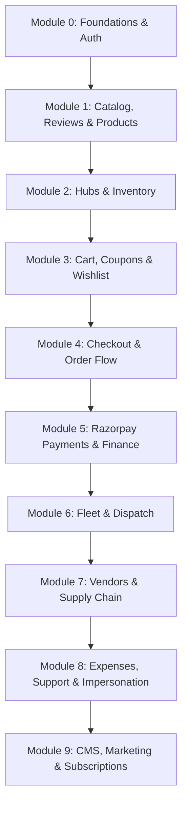

# Mumzo Quick-Commerce Master Roadmap

This master roadmap outlines the module-by-module plan for building the **Mumzo Quick-Commerce Platform** (10-minute delivery for moms and babies). It serves as a comprehensive guide for features delivered across the **Admin Control Panel** and **Platform Storefront (Customer App)**, acting as the primary checklist for verification.

---

## 📅 Roadmap Overview

---

## 🛠️ Module 0: Foundations & Authentication
Establish unified API communication and secure session gating on both applications.

### 📋 Prerequisites & Requirements
* Resend email account credentials.
* Configured SMTP/API keys for transactional mail.

### ✅ Deliverables & Verification Checklist
* **Admin Panel**:
  * [x] Secure route check redirects unauthenticated visitors to `/auth/login`.
  * [x] Clear auth cache on login/logout to prevent redirection loops.
  * [x] "My Profile" settings page displaying active staff details, roles, and resolved system permissions.
* **Platform Storefront** (phone + OTP only — there is no email/password identity on this
  app, so registration/email-verification/forgot-password by email do not apply):
  * [x] Shared TanStack Query data layer initialized.
  * [x] Secure route check redirects guests from profile/checkout pages.
  * [x] Working phone + OTP sign-in flow (unified sign-in/sign-up via Better Auth's
    `phoneNumber` plugin — no separate registration step needed).

> Module 0 is done for both apps under the phone-OTP scope. Skipping straight to
> **Module 1: Catalog, Products & Reviews** next.

---

## 📦 Module 1: Catalog, Products & Reviews
Configure product variants, categories, media assets, and user-generated content (reviews).

### 📋 Prerequisites & Requirements
* Cloudflare R2 bucket credentials and CDN domain resolution (`cdn.mumzo.in`).

### ✅ Deliverables & Verification Checklist
* **Admin Panel (Products & Categories)**:
  * [ ] Active products directory list showing SKUs, variants, prices, MRPs, and stock status.
  * [ ] Product create/edit forms with support for adding multiple pack size variants (sizes, weight, prices).
  * [ ] Direct Cloudflare R2 image upload tool on product forms.
  * [ ] Arched categories tree list with drag-and-drop ordering.
  * [ ] Category detail panel to add category icons, taglines, branding wash colors, and associate brands.
  * [ ] Brands directory to organize products under manufacturers.
  * [ ] Bundles & Combos manager to package multi-product deals with discount pricing.
* **Admin Panel (UGC Moderation Queue)**:
  * [ ] Review Moderation Queue list showing submitted ratings, text, and user attachments.
  * [ ] Approval workflow (Approve / Reject review with reason) before reviews show on customer app.
  * [ ] Automated spam/profanity screen toggle for reviews.
* **Platform Storefront (Customer Discovery)**:
  * [ ] Category shelf grid cards rendering live category names and colors on the Home page.
  * [ ] Category products page displaying items list with brand, price, and stock filters.
  * [ ] Product Detail Page (PDP) displaying image sliders, description bullet points, and variant dropdown selector.
  * [ ] Price metrics display on product cards showing calculated savings (MRP vs current price).
  * [ ] Age-suitability and ingredients details block on PDP (crucial for baby foods and formulas).
* **Platform Storefront (UGC Reviews)**:
  * [ ] Review submission form on PDP (star ratings, title, description, and photo attachments).
  * [ ] Verified Purchase Badge rendering on reviews made by actual buyers.
  * [ ] Helpful Vote counter button on product review cards.

---

## 🔋 Module 2: Dark Store Hubs & Real-time Inventory
Configure physical warehouses (hubs), serviceability zones, and dark store inventory levels.

### 📋 Prerequisites & Requirements
* List of serviceable Hyderabad pincodes and corresponding warehouse geographic coordinates.

### ✅ Deliverables & Verification Checklist
* **Admin Panel**:
  * [ ] Dark store hubs management panel (add hub, coordinates, and contact details).
  * [ ] Pincode mapping tool to assign served pincodes to hubs.
  * [ ] Real-time inventory grid showing stock quantities per SKU at each hub.
  * [ ] Stock adjustment modal to log manual additions, returns, or wastage.
  * [ ] Low-stock alerts dashboard page flagging items below hub reorder points.
* **Platform Storefront**:
  * [ ] Pincode gate overlay blocking home page access until a serviceable address is verified.
  * [ ] Pincode-to-hub mapping check storing the user's active fulfillment warehouse ID.
  * [ ] Stock check guard changing "Add to Cart" to "Out of Stock" if current hub inventory is 0.

---

## 🛒 Module 3: Cart, Coupons & Wishlist
Manage device cart state, customer wishlists, and promotional coupons.

### 📋 Prerequisites & Requirements
* Marketing promo parameters (percentage caps, first-order limits, expiry rules).

### ✅ Deliverables & Verification Checklist
* **Admin Panel**:
  * [ ] Coupon creator form (code, expiry, flat/percentage values, minimum order values, caps).
  * [ ] Target setting gates (e.g. Coupon applies only to first orders, or only for "Baby Food" category).
  * [ ] Coupon redemptions and usage statistics display.
* **Platform Storefront (Cart & Wishlist)**:
  * [ ] Offline-first cart persistence using localStorage cache.
  * [ ] Automatic cart sync logic sending items list to server on user sign-in.
  * [ ] Customer Wishlist (Save for Later) list with one-click "Move to Cart" button.
  * [ ] Out-of-stock item warning indicators inside the cart drawer.
* **Platform Storefront (Promotions)**:
  * [ ] Promotions field at checkout to type coupon codes.
  * [ ] Cart progress nudge bar displaying how much more to add for free delivery.
  * [ ] Bestseller / complementary products recommendations tray in the cart drawer.

---

## 🛍️ Module 4: Checkout & Order Lifecycle
Validate delivery locations, temporarily hold stock, and process order lifecycles.

### 📋 Prerequisites & Requirements
* Defined delivery fee rules and minimum order requirements.

### ✅ Deliverables & Verification Checklist
* **Admin Panel**:
  * [ ] Central orders queue with filters for status, date, and hub.
  * [ ] Order detail page showing purchased items, totals, delivery address, and status timeline.
  * [ ] Status progression controls (Confirm ➔ Pack ➔ Dispatch ➔ Deliver).
  * [ ] SLA breach warning indicators showing orders not packed within 5 minutes or not dispatched within 8 minutes.
* **Platform Storefront**:
  * [ ] Saved address book CRUD manager with a map pin selector.
  * [ ] Order summary breakdown displaying Subtotal, Coupons, GST (5%), Delivery Fee, and Final Total.
  * [ ] Inventory stock lock holding items for 10 minutes during payment checkout.
  * [ ] Real-time order progress timeline tracking pack and dispatch events.
  * [ ] Cancellation initiator button (only active before order is packed).

---

## 💳 Module 5: Razorpay Payments & Finance
Charge customers securely online, automate refunds, and track accounting ledgers.

### 📋 Prerequisites & Requirements
* Active Razorpay Merchant test/production credentials and Webhook signing secret.

### ✅ Deliverables & Verification Checklist
* **Admin Panel (Finance & Payments)**:
  * [ ] Payments transactions auditing table.
  * [ ] Failed & pending transactions logs dashboard (to recover abandoned checkouts).
  * [ ] Direct refund initiator button on returned/cancelled order details.
  * [ ] GST/tax reports exporter tool (filtered by date).
* **Platform Storefront**:
  * [ ] Razorpay Checkout SDK popup overlay on payment initiation.
  * [ ] Signature-verified webhook handler for payment success, failure, and refund events.
  * [ ] Transaction status redirection screens (Success / Failure feedback).
  * [ ] Automatic invoice PDF generator available for download on order history.

---

## 🚴 Module 6: Fleet Operations & Delivery Dispatch
Onboard delivery riders, coordinate shifts, and assign orders for 10-minute dispatch.

### 📋 Prerequisites & Requirements
* Rider KYC documentation guidelines and fleet zone mapping.

### ✅ Deliverables & Verification Checklist
* **Admin Panel**:
  * [ ] Rider directory showing name, phone, and delivery status (online, delivering, offline).
  * [ ] Live dispatch board showing ready-to-dispatch orders and idle riders.
  * [ ] Rider assignment button matching orders to closest idle delivery riders.
  * [ ] 3PL Delivery Integration (e.g. Shiprocket/Dunzo API fallback) for out-of-zone orders.
* **Platform Storefront**:
  * [ ] Order track page displaying rider details (name, phone) once dispatched.
  * [ ] Customer verification OTP display to show riders upon arrival.

---

## 🤝 Module 7: Vendors, Distributors & Supply Chain
Manage manufacturers, local distributors, purchase orders, and audit incoming inventory.

### 📋 Prerequisites & Requirements
* Wholesaler and distributor contact database.

### ✅ Deliverables & Verification Checklist
* **Admin Panel**:
  * [ ] Vendors directory displaying manufacturer/brand details, contact persons, and GSTINs.
  * [ ] Distributors directory to track regional distribution hubs, delivery lead times, and payment credit terms.
  * [ ] Purchase Order (PO) builder to draft inventory requests with buying cost prices.
  * [ ] Goods Received Note (GRN) sheet to confirm received quantities, updating active hub inventory count.

---

## 🧾 Module 8: Expenses, Support & Impersonation
Track dark store expenditures, resolve customer complaints, and debug user errors.

### 📋 Prerequisites & Requirements
* Standard operating cost categories (rent, utilities, rider compensation, materials).

### ✅ Deliverables & Verification Checklist
* **Admin Panel (Expenses & Support)**:
  * [ ] Log Expense form to track warehouse expenditures and upload receipt files.
  * [ ] Rider payouts settlement dashboard to approve or reject weekly rider claims.
  * [ ] Customer tickets queue listing incoming queries tied to specific order IDs.
  * [ ] Banning / Unbanning tools on user profiles to block malicious accounts.
* **Admin Panel (Support Impersonation)**:
  * [ ] audited Customer Impersonation module (let support staff safely log into the storefront as the customer to debug order/cart errors).
* **Platform Storefront**:
  * [ ] Help center / FAQ static pages directory.
  * [ ] Support tickets initiator form (linked to orders).

---

## 🖼️ Module 9: CMS, Marketing & Subscriptions
Configure app settings, promotion banners, referral rules, and repeat subscriptions.

### 📋 Prerequisites & Requirements
* Legal terms drafts and storefront promotional banners asset designs.

### ✅ Deliverables & Verification Checklist
* **Admin Panel**:
  * [ ] Storefront banners manager (image upload, display order, target links).
  * [ ] Feature flags list to enable/disable system features without redeploying.
  * [ ] Rich-text static page editor for T&C, Refund policies, and Privacy guidelines.
  * [ ] Subscriptions dashboard listing active recurring orders and upcoming delivery calendar.
  * [ ] FCM push notifications templates builder and segment-based target broadcasts.
* **Platform Storefront (Marketing & Subscriptions)**:
  * [ ] Top header banner carousel slider on the Home page.
  * [ ] Feature-flag gated client routing.
  * [ ] "Subscribe & Forget" scheduler on PDPs (weekly, bi-weekly, monthly) with frequency updates.
  * [ ] Subscription Manager dashboard under profile settings (Pause, Resume, or Edit next delivery date).
  * [ ] Invite-a-Mom referral rewards program console.
